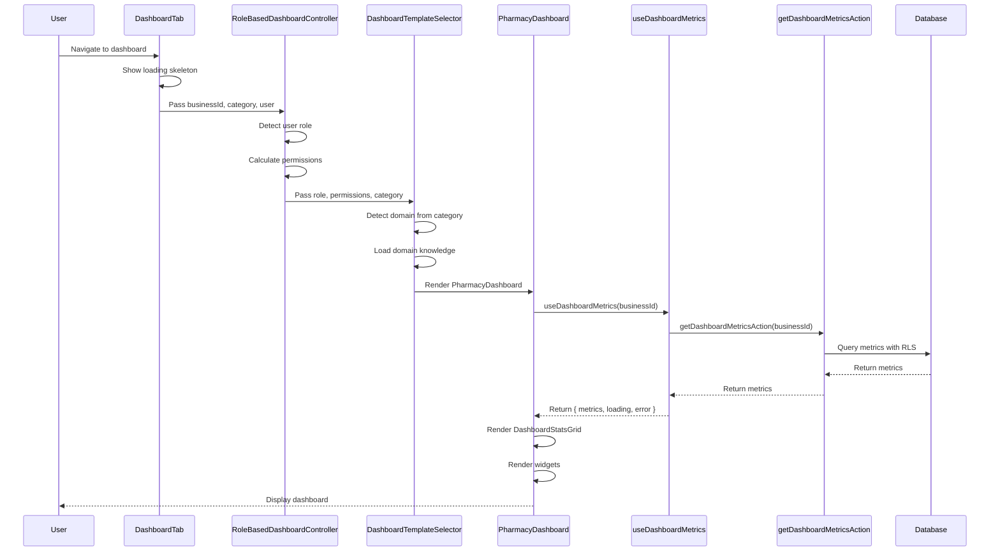
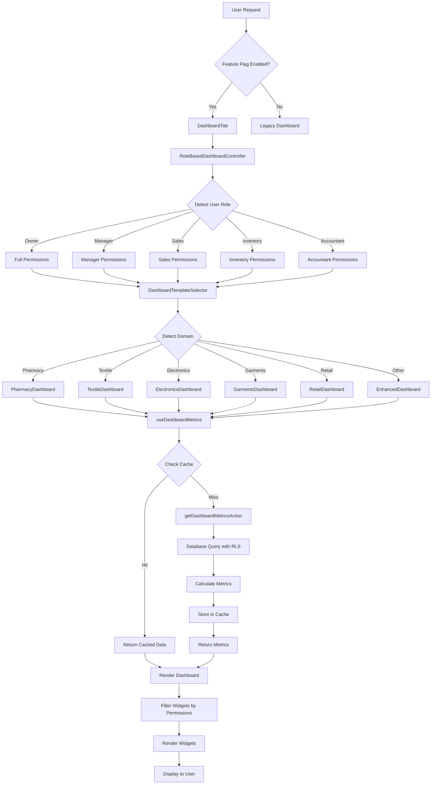
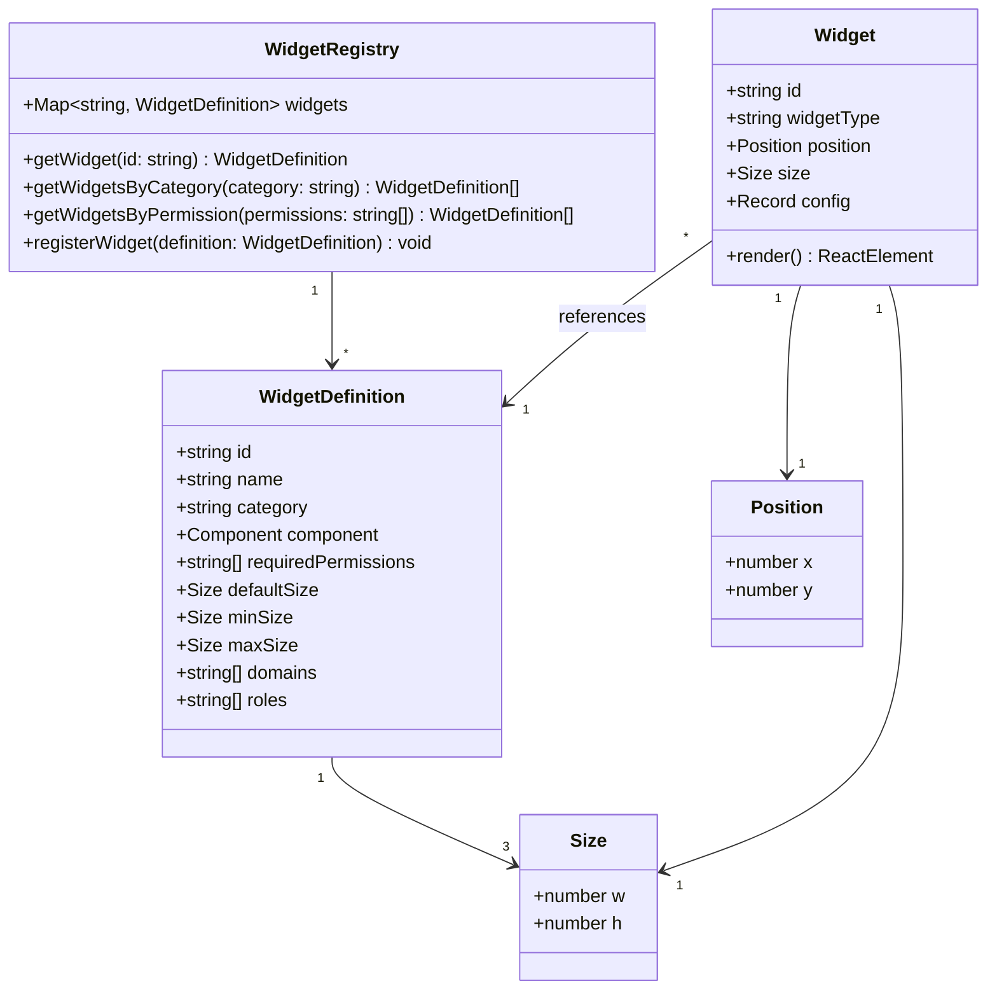
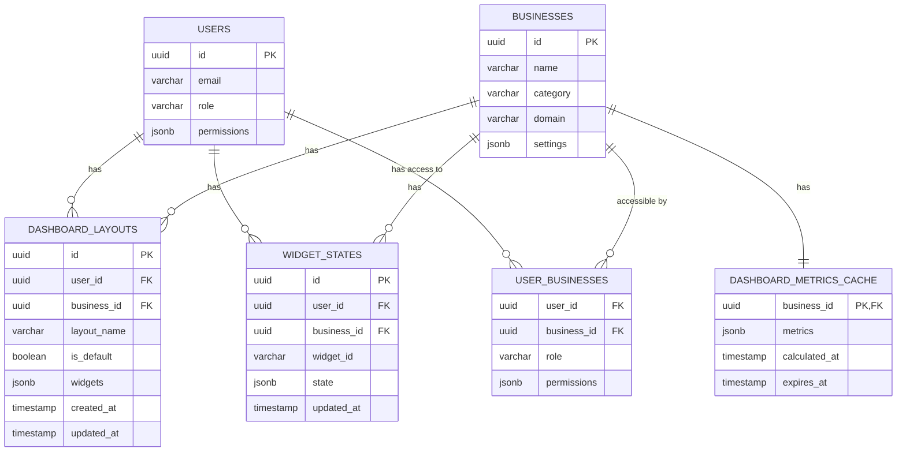
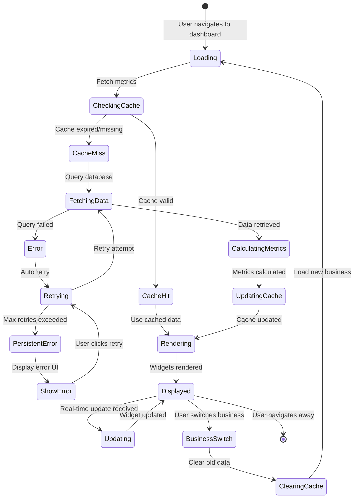

# Design Document: Dashboard System Consolidation & Enterprise Integration

## Overview

This design document specifies the architecture for consolidating two separate dashboard systems (DashboardTab.tsx and EnhancedDashboard.jsx) into a unified, enterprise-grade dashboard architecture. The consolidation addresses critical issues including 60% code duplication across 11 templates, disabled role-based functionality, poor tab integration, and architectural inconsistencies.

### Current State

The application currently has two separate dashboard implementations:

1. **DashboardTab.tsx** - NetSuite-inspired grid layout with portlets, integrated into the tab navigation system
2. **EnhancedDashboard.jsx + Templates** - Card-based responsive dashboard with domain-specific and role-based templates

These systems operate independently, creating maintenance overhead, inconsistent user experience, and duplicate data fetching logic.

### Target State

A unified dashboard system that:
- Uses DashboardTab as the primary container with NetSuite-style grid layout
- Integrates RoleBasedDashboardController for role-based logic
- Leverages DashboardTemplateSelector for domain-specific customization
- Provides shared, reusable components to eliminate 60% code duplication
- Maintains all existing functionality while improving maintainability

### Design Goals

1. **Single Source of Truth**: One dashboard rendering system for all use cases
2. **Code Reusability**: Extract common patterns into shared components
3. **Role-Based Access**: Enable role-specific dashboard templates and widget filtering
4. **Domain Customization**: Maintain industry-specific dashboard features
5. **Multi-Tenant Isolation**: Ensure complete data isolation between businesses
6. **Performance**: Achieve <2s initial load, <1s widget load times
7. **Maintainability**: Reduce code duplication by 60%+

## Architecture

### System Architecture

```
┌─────────────────────────────────────────────────────────────┐
│                app/business/[category]/page.js              │
│                                                             │
│  ┌──────────────────────────────────────────────────────┐  │
│  │         DashboardTabs (Tab Navigation)               │  │
│  └──────────────────────────────────────────────────────┘  │
│                           │                                 │
│  ┌────────────────────────▼──────────────────────────────┐  │
│  │              DashboardTab.tsx                         │  │
│  │         (Container + NetSuite Grid Layout)            │  │
│  │                                                       │  │
│  │  ┌─────────────────────────────────────────────────┐  │  │
│  │  │    RoleBasedDashboardController.jsx             │  │  │
│  │  │    (Role Detection & Permission Filtering)      │  │  │
│  │  │                                                 │  │  │
│  │  │  ┌───────────────────────────────────────────┐  │  │  │
│  │  │  │   DashboardTemplateSelector.jsx           │  │  │  │
│  │  │  │   (Domain Detection & Template Loading)   │  │  │  │
│  │  │  │                                           │  │  │  │
│  │  │  │  ┌─────────────────────────────────────┐  │  │  │  │
│  │  │  │  │  Specific Dashboard Template        │  │  │  │  │
│  │  │  │  │  (PharmacyDashboard, etc.)          │  │  │  │  │
│  │  │  │  │                                     │  │  │  │  │
│  │  │  │  │  Uses:                              │  │  │  │  │
│  │  │  │  │  - DashboardStatsGrid               │  │  │  │  │
│  │  │  │  │  - DashboardLoadingSkeleton         │  │  │  │  │
│  │  │  │  │  - useDashboardMetrics hook         │  │  │  │  │
│  │  │  │  │  - RevenueChartSection              │  │  │  │  │
│  │  │  │  │  - Widget Library                   │  │  │  │  │
│  │  │  │  └─────────────────────────────────────┘  │  │  │  │
│  │  │  └───────────────────────────────────────────┘  │  │  │
│  │  └─────────────────────────────────────────────────┘  │  │
│  └───────────────────────────────────────────────────────┘  │
└─────────────────────────────────────────────────────────────┘
```

### Component Hierarchy

```
DashboardTab (Container)
├── Header
│   ├── BusinessSwitcher
│   ├── QuickActions
│   ├── Notifications
│   └── UserMenu
├── NetsuiteDashboard (Grid Layout)
│   ├── Sidebar (3 columns)
│   │   ├── RemindersPortlet
│   │   └── NavigationMenu
│   └── MainContent (9 columns)
│       └── RoleBasedDashboardController
│           └── DashboardTemplateSelector
│               └── [Domain/Role Template]
│                   ├── DashboardStatsGrid
│                   ├── RevenueChartSection
│                   └── Widget Grid
│                       ├── InventoryValuationWidget
│                       ├── BatchExpiryWidget
│                       ├── SerialWarrantyWidget
│                       └── [Domain-specific widgets]
└── Footer
```

### Data Flow

```
┌──────────────┐
│   User       │
└──────┬───────┘
       │
       ▼
┌──────────────────────────────────────────────────────┐
│  DashboardTab                                        │
│  - Receives: businessId, category, user             │
│  - Fetches: getDashboardMetricsAction(businessId)   │
└──────┬───────────────────────────────────────────────┘
       │
       ▼
┌──────────────────────────────────────────────────────┐
│  RoleBasedDashboardController                        │
│  - Detects: user.role                                │
│  - Filters: widgets by permissions                   │
│  - Passes: userRole, hasPermission()                 │
└──────┬───────────────────────────────────────────────┘
       │
       ▼
┌──────────────────────────────────────────────────────┐
│  DashboardTemplateSelector                           │
│  - Detects: business.category                        │
│  - Loads: domain knowledge                           │
│  - Selects: appropriate template                     │
└──────┬───────────────────────────────────────────────┘
       │
       ▼
┌──────────────────────────────────────────────────────┐
│  Specific Template (e.g., PharmacyDashboard)         │
│  - Uses: useDashboardMetrics(businessId)             │
│  - Renders: DashboardStatsGrid, widgets              │
│  - Filters: widgets by hasPermission()               │
└──────┬───────────────────────────────────────────────┘
       │
       ▼
┌──────────────────────────────────────────────────────┐
│  Individual Widgets                                  │
│  - Fetch: widget-specific data                       │
│  - Subscribe: real-time updates (Supabase)           │
│  - Render: widget UI                                 │
└──────────────────────────────────────────────────────┘
```

### Integration Strategy

The unified system integrates the two existing systems through a phased approach:

**Phase 1: Component Extraction**
- Extract shared components from templates
- Create reusable hooks for data fetching
- Standardize widget interfaces

**Phase 2: Controller Integration**
- Integrate RoleBasedDashboardController into DashboardTab
- Update routing to use unified system
- Enable role-based template selection

**Phase 3: Template Migration**
- Migrate domain templates to use shared components
- Update templates to work with NetSuite grid layout
- Remove duplicate code

**Phase 4: Deprecation**
- Deprecate standalone EnhancedDashboard usage
- Update all routes to use DashboardTab
- Remove legacy code

## Components and Interfaces

### Core Components

#### 1. DashboardTab (Container)

**Purpose**: Primary container component that provides layout structure and integrates the unified dashboard system.

**Location**: `app/business/[category]/components/tabs/DashboardTab.tsx`

**Interface**:
```typescript
interface DashboardTabProps {
  businessId: string;
  category: string;
  user: User;
  dateRange: { from: Date; to: Date };
  currency?: CurrencyCode;
  onQuickAction?: (actionId: string) => void;
}

interface User {
  id: string;
  role: 'owner' | 'manager' | 'sales_staff' | 'inventory_staff' | 'accountant';
  permissions: string[];
}
```

**Responsibilities**:
- Provide NetSuite-style grid layout
- Fetch centralized dashboard metrics
- Pass business context to child components
- Handle loading and error states
- Manage header and navigation

#### 2. RoleBasedDashboardController

**Purpose**: Manages role-based logic, permission filtering, and template selection.

**Location**: `components/dashboard/RoleBasedDashboardController.jsx`

**Interface**:
```typescript
interface RoleBasedDashboardControllerProps {
  businessId: string;
  category: string;
  user: User;
  onQuickAction?: (actionId: string) => void;
}
```

**Responsibilities**:
- Detect user role from user context
- Determine widget permissions based on role
- Provide hasPermission() function to child components
- Pass role information to DashboardTemplateSelector
- Enable/disable role-based templates via feature flag

#### 3. DashboardTemplateSelector

**Purpose**: Selects and loads the appropriate dashboard template based on business domain.

**Location**: `components/dashboard/DashboardTemplateSelector.jsx`

**Interface**:
```typescript
interface DashboardTemplateSelectorProps {
  businessId: string;
  category: string;
  userRole: string;
  hasPermission: (widgetType: string) => boolean;
  onQuickAction?: (actionId: string) => void;
  forceTemplate?: string; // For testing
}
```

**Responsibilities**:
- Map category to template type
- Load domain knowledge
- Lazy load appropriate template component
- Pass role and permission context to template

#### 4. DashboardStatsGrid (Shared Component)

**Purpose**: Reusable component for rendering stat cards in a consistent grid layout.

**Location**: `components/dashboard/common/DashboardStatsGrid.jsx`

**Interface**:
```typescript
interface DashboardStatsGridProps {
  stats: StatCard[];
  colors: DomainColors;
  onStatClick?: (statId: string) => void;
  columns?: 2 | 3 | 4; // Grid columns
}

interface StatCard {
  id: string;
  label: string;
  value: string | number;
  change?: number;
  trend?: 'up' | 'down' | 'neutral';
  icon?: string;
  target?: number;
  unit?: string;
}
```

**Responsibilities**:
- Render stat cards in responsive grid
- Apply domain-specific colors
- Handle click events
- Display progress bars for targets
- Show trend indicators

#### 5. DashboardLoadingSkeleton (Shared Component)

**Purpose**: Reusable loading state component for dashboards.

**Location**: `components/dashboard/common/DashboardLoadingSkeleton.jsx`

**Interface**:
```typescript
interface DashboardLoadingSkeletonProps {
  cardCount?: number;
  showChart?: boolean;
  showWidgets?: boolean;
  layout?: 'grid' | 'list';
}
```

**Responsibilities**:
- Display skeleton cards during loading
- Match dashboard layout structure
- Provide smooth loading experience
- Support different layouts

#### 6. RevenueChartSection (Shared Component)

**Purpose**: Reusable revenue chart component with time range selection.

**Location**: `components/dashboard/common/RevenueChartSection.jsx`

**Interface**:
```typescript
interface RevenueChartSectionProps {
  data: ChartDataPoint[];
  colors: DomainColors;
  timeRange?: '7d' | '30d' | '90d' | '1y';
  onTimeRangeChange?: (range: string) => void;
  onExport?: () => void;
  title?: string;
  description?: string;
}

interface ChartDataPoint {
  date: string;
  revenue: number;
  expenses?: number;
  profit?: number;
}
```

**Responsibilities**:
- Render revenue area chart
- Provide time range selector
- Support data export
- Apply domain colors
- Show revenue vs expenses comparison

### Hooks

#### useDashboardMetrics

**Purpose**: Centralized hook for fetching dashboard metrics with caching and error handling.

**Location**: `lib/hooks/useDashboardMetrics.js`

**Interface**:
```typescript
function useDashboardMetrics(businessId: string): {
  metrics: DashboardMetrics | null;
  loading: boolean;
  error: Error | null;
  refetch: () => Promise<void>;
}

interface DashboardMetrics {
  revenue: number;
  growth: {
    percentage: number;
    trend: 'up' | 'down' | 'neutral';
  };
  orders: {
    total: number;
    pending: number;
    paid: number;
  };
  customers: {
    active: number;
    growth: number;
  };
  cashFlow: {
    current: number;
    growth: number;
  };
  alerts: {
    lowStock: number;
    overdueInvoices: number;
    expiringBatches: number;
  };
  inventory: {
    value: number;
    items: number;
  };
}
```

**Implementation**:
- Uses React Query for caching (5-minute TTL)
- Calls getDashboardMetricsAction server action
- Handles loading and error states
- Provides refetch function for manual refresh
- Automatically refetches on businessId change

### Widget Registry

**Purpose**: Centralized catalog of all available widgets with metadata.

**Location**: `lib/widgets/widgetRegistry.js`

**Structure**:
```typescript
interface WidgetDefinition {
  id: string;
  name: string;
  category: 'inventory' | 'sales' | 'finance' | 'pakistani' | 'general';
  component: React.ComponentType<WidgetProps>;
  requiredPermissions: string[];
  defaultSize: { w: number; h: number };
  minSize: { w: number; h: number };
  maxSize: { w: number; h: number };
  domains?: string[]; // Specific domains this widget applies to
  roles?: string[]; // Specific roles this widget applies to
}

const widgetRegistry: Record<string, WidgetDefinition> = {
  'inventory-valuation': {
    id: 'inventory-valuation',
    name: 'Inventory Valuation',
    category: 'inventory',
    component: InventoryValuationWidget,
    requiredPermissions: ['inventory.view'],
    defaultSize: { w: 6, h: 4 },
    minSize: { w: 4, h: 3 },
    maxSize: { w: 12, h: 6 },
  },
  // ... more widgets
};
```

## Data Models

### Dashboard Layout

**Table**: `dashboard_layouts`

```sql
CREATE TABLE dashboard_layouts (
  id UUID PRIMARY KEY DEFAULT uuid_generate_v4(),
  user_id UUID NOT NULL REFERENCES users(id) ON DELETE CASCADE,
  business_id UUID NOT NULL REFERENCES businesses(id) ON DELETE CASCADE,
  layout_name VARCHAR(255) NOT NULL,
  is_default BOOLEAN DEFAULT false,
  widgets JSONB NOT NULL, -- Array of widget configurations
  created_at TIMESTAMP WITH TIME ZONE DEFAULT NOW(),
  updated_at TIMESTAMP WITH TIME ZONE DEFAULT NOW(),
  
  UNIQUE(user_id, business_id, layout_name)
);

-- RLS Policy
ALTER TABLE dashboard_layouts ENABLE ROW LEVEL SECURITY;

CREATE POLICY dashboard_layouts_isolation ON dashboard_layouts
  USING (business_id IN (
    SELECT business_id FROM user_businesses WHERE user_id = auth.uid()
  ));
```

**Widget Configuration Schema**:
```typescript
interface WidgetConfiguration {
  id: string; // Widget instance ID
  widgetType: string; // Widget type from registry
  position: { x: number; y: number };
  size: { w: number; h: number };
  config: Record<string, any>; // Widget-specific configuration
}
```

### Dashboard Metrics Cache

**Table**: `dashboard_metrics_cache`

```sql
CREATE TABLE dashboard_metrics_cache (
  business_id UUID PRIMARY KEY REFERENCES businesses(id) ON DELETE CASCADE,
  metrics JSONB NOT NULL,
  calculated_at TIMESTAMP WITH TIME ZONE DEFAULT NOW(),
  expires_at TIMESTAMP WITH TIME ZONE DEFAULT (NOW() + INTERVAL '5 minutes')
);

-- RLS Policy
ALTER TABLE dashboard_metrics_cache ENABLE ROW LEVEL SECURITY;

CREATE POLICY dashboard_metrics_cache_isolation ON dashboard_metrics_cache
  USING (business_id IN (
    SELECT business_id FROM user_businesses WHERE user_id = auth.uid()
  ));

-- Index for expiration cleanup
CREATE INDEX idx_dashboard_metrics_cache_expires 
  ON dashboard_metrics_cache(expires_at);
```

### Widget State

**Table**: `widget_states`

```sql
CREATE TABLE widget_states (
  id UUID PRIMARY KEY DEFAULT uuid_generate_v4(),
  user_id UUID NOT NULL REFERENCES users(id) ON DELETE CASCADE,
  business_id UUID NOT NULL REFERENCES businesses(id) ON DELETE CASCADE,
  widget_id VARCHAR(255) NOT NULL,
  state JSONB NOT NULL, -- Widget-specific state
  updated_at TIMESTAMP WITH TIME ZONE DEFAULT NOW(),
  
  UNIQUE(user_id, business_id, widget_id)
);

-- RLS Policy
ALTER TABLE widget_states ENABLE ROW LEVEL SECURITY;

CREATE POLICY widget_states_isolation ON widget_states
  USING (business_id IN (
    SELECT business_id FROM user_businesses WHERE user_id = auth.uid()
  ));
```

## API Specifications

### Server Actions

#### getDashboardMetricsAction

**Purpose**: Centralized server action for fetching all dashboard metrics.

**Location**: `lib/actions/premium/ai/analytics.js`

**Signature**:
```typescript
async function getDashboardMetricsAction(
  businessId: string
): Promise<ActionResult<DashboardMetrics>>
```

**Implementation**:
- Checks authentication and permissions
- Queries database for metrics (revenue, orders, customers, inventory, alerts)
- Calculates growth percentages
- Returns standardized metrics object
- Implements caching via dashboard_metrics_cache table

**Caching Strategy**:
1. Check cache table for valid entry (not expired)
2. If cache hit, return cached metrics
3. If cache miss, calculate metrics from database
4. Store in cache with 5-minute expiration
5. Return calculated metrics

#### saveDashboardLayoutAction

**Purpose**: Save user's dashboard layout customization.

**Location**: `lib/actions/dashboard/layout.js`

**Signature**:
```typescript
async function saveDashboardLayoutAction(
  businessId: string,
  layoutName: string,
  widgets: WidgetConfiguration[],
  isDefault?: boolean
): Promise<ActionResult<{ id: string }>>
```

**Implementation**:
- Validates user has access to business
- Validates widget configurations
- Upserts dashboard_layouts record
- If isDefault=true, unsets other default layouts
- Returns layout ID

#### getDashboardLayoutAction

**Purpose**: Retrieve user's saved dashboard layout.

**Location**: `lib/actions/dashboard/layout.js`

**Signature**:
```typescript
async function getDashboardLayoutAction(
  businessId: string,
  layoutName?: string
): Promise<ActionResult<DashboardLayout>>
```

**Implementation**:
- Fetches layout by name, or default layout if no name provided
- Falls back to template default if no saved layout exists
- Returns layout configuration

### Real-Time Subscriptions

#### Dashboard Metrics Updates

**Channel**: `dashboard:${businessId}`

**Events**:
- `metrics_updated`: Triggered when dashboard metrics change
- `inventory_alert`: Triggered when inventory alerts occur
- `order_created`: Triggered when new order is created
- `payment_received`: Triggered when payment is received

**Implementation**:
```typescript
// In useDashboardMetrics hook
useEffect(() => {
  const channel = supabase
    .channel(`dashboard:${businessId}`)
    .on('broadcast', { event: 'metrics_updated' }, (payload) => {
      setMetrics(payload.metrics);
    })
    .subscribe();

  return () => {
    supabase.removeChannel(channel);
  };
}, [businessId]);
```

## Correctness Properties

*A property is a characteristic or behavior that should hold true across all valid executions of a system-essentially, a formal statement about what the system should do. Properties serve as the bridge between human-readable specifications and machine-verifiable correctness guarantees.*


### Property Reflection

After analyzing all acceptance criteria, I've identified the following testable properties and eliminated redundancy:

**Redundancies Identified:**
1. Requirements 1.3 and 20.2 both test route backward compatibility - combined into one property
2. Requirements 3.7 and 3.8 both test permission-based widget filtering - same property stated differently
3. Requirements 4.6 and 7.1 both test domain detection from category field - duplicate
4. Requirements 10.2, 10.3, 10.4 test specific costing methods - can be combined into one comprehensive property about costing calculations
5. Multiple role-based template examples (3.2-3.6) can be tested with one property about role-template mapping

**Properties After Consolidation:**
- Route compatibility: 1 property (covers 1.3, 20.2)
- Widget permission filtering: 1 property (covers 3.7, 3.8)
- Domain detection: 1 property (covers 4.6, 7.1)
- Costing calculations: 1 comprehensive property (covers 10.2, 10.3, 10.4)
- Role-template mapping: 1 property (covers 3.2-3.6 as examples)
- Layout persistence: 1 round-trip property (covers 9.3, 9.4)
- Multi-tenant isolation: 2 properties (data filtering + cache clearing)

### Property 1: Route Backward Compatibility

*For any* existing dashboard route path, navigating to that route should successfully render a dashboard through the unified DashboardTab component without errors.

**Validates: Requirements 1.3, 1.4, 20.2**

### Property 2: Widget Functionality Preservation

*For any* widget that existed in either the DashboardTab or EnhancedDashboard system, that widget should render correctly and fetch data successfully in the unified system.

**Validates: Requirements 1.5**

### Property 3: Stats Grid Rendering

*For any* valid stats data array and color configuration, the DashboardStatsGrid component should render the correct number of stat cards with consistent styling and handle click events.

**Validates: Requirements 2.1, 2.2**

### Property 4: Loading Skeleton Configuration

*For any* valid card count parameter, the DashboardLoadingSkeleton component should render exactly that many skeleton cards.

**Validates: Requirements 2.4**

### Property 5: Dashboard Metrics Hook Contract

*For any* valid business ID, the useDashboardMetrics hook should return an object containing metrics, loading state, error state, and refetch function properties.

**Validates: Requirements 2.5, 2.6**

### Property 6: Chart Time Range Support

*For any* valid time range value, the RevenueChartSection component should accept the time range prop and call the onTimeRangeChange handler when the user changes the selection.

**Validates: Requirements 2.8**

### Property 7: Permission-Based Widget Filtering

*For any* user role and any widget type, if the role does not have the required permission for that widget, the widget should not be rendered in the dashboard layout.

**Validates: Requirements 3.7, 3.8, 8.3**

### Property 8: Layout Persistence Round-Trip

*For any* valid dashboard layout configuration, saving the layout and then loading it should return an equivalent layout configuration with the same widget positions and sizes.

**Validates: Requirements 3.9, 9.3, 9.4**

### Property 9: Domain Detection

*For any* business object with a category field, the Dashboard_System should correctly identify and load the appropriate domain knowledge and template.

**Validates: Requirements 4.6, 7.1, 7.2**

### Property 10: Domain-Role Widget Merging

*For any* combination of business domain and user role, the resulting widget list should include widgets from both the domain-specific set and the role-specific set.

**Validates: Requirements 4.7**

### Property 11: Domain Widget Prioritization

*For any* dashboard layout where both domain-specific and generic widgets are present, domain-specific widgets should appear before generic widgets in the layout order.

**Validates: Requirements 4.8**

### Property 12: Template Selection

*For any* valid domain and role combination, the DashboardTemplateSelector should render the correct template component based on the domain category.

**Validates: Requirements 5.8**

### Property 13: Multi-Tenant Data Isolation

*For any* data query in any widget or dashboard component, the query should include a business_id filter matching the current business context.

**Validates: Requirements 6.1, 6.4, 6.6**

### Property 14: Business Context Switching

*For any* business switch operation, all widgets should refetch their data with the new business_id and all cached data from the previous business should be cleared.

**Validates: Requirements 6.3, 6.7, 12.3**

### Property 15: Domain Knowledge Feature Flags

*For any* domain knowledge object, if a feature flag (batchTrackingEnabled, serialTrackingEnabled, multiLocationEnabled) is true, the corresponding widgets should be present in the dashboard layout.

**Validates: Requirements 7.3, 7.4, 7.5**

### Property 16: Domain Feature Isolation

*For any* two different business domains, domain-specific features and widgets from one domain should not appear in the dashboard for the other domain.

**Validates: Requirements 7.7**

### Property 17: Widget Registry Metadata

*For any* widget in the Widget_Registry, the widget definition should contain id, name, category, requiredPermissions, defaultSize, minSize, and maxSize fields.

**Validates: Requirements 8.2, 8.7**

### Property 18: Widget Size Constraints

*For any* rendered widget, its displayed size should be greater than or equal to its minSize and less than or equal to its maxSize as defined in the Widget_Registry.

**Validates: Requirements 8.8**

### Property 19: Multiple Layout Presets

*For any* user and business combination, the user should be able to save multiple named layout presets, with at most one marked as default.

**Validates: Requirements 9.5, 9.6**

### Property 20: Inventory Costing Calculations

*For any* inventory with a configured costing method (FIFO, LIFO, or WAC) and a set of stock transactions, the calculated inventory valuation should correctly apply the specified costing algorithm.

**Validates: Requirements 10.1, 10.2, 10.3, 10.4**

### Property 21: Batch Expiry Alerts

*For any* product batch, if the batch expiry date is within 90 days from today, the batch should appear in the expiry alerts list.

**Validates: Requirements 10.5**

### Property 22: Batch Expiry Severity Classification

*For any* product batch with an expiry date, the severity should be classified as critical if expiring in <30 days, warning if 30-90 days, or normal if >90 days.

**Validates: Requirements 10.6**

### Property 23: Low Stock Alerts

*For any* product where current stock is less than the minimum stock level, the product should appear in the low stock alerts list.

**Validates: Requirements 10.10**

### Property 24: Dashboard Load Performance

*For any* dashboard load operation, the initial render should complete within 2 seconds, and individual widgets should load within 1 second of dashboard render.

**Validates: Requirements 11.1, 11.2**

### Property 25: Metrics Caching

*For any* dashboard metrics request, if valid cached data exists (not expired, TTL < 5 minutes), the cached data should be returned without querying the database.

**Validates: Requirements 11.4**

### Property 26: Incremental Widget Loading

*For any* widget positioned below the fold (not initially visible), the widget should not fetch data until it becomes visible in the viewport.

**Validates: Requirements 11.6**

### Property 27: Loading State Display

*For any* widget or dashboard component in a loading state, a loading skeleton should be visible to the user.

**Validates: Requirements 11.7**

### Property 28: Business Switcher Content

*For any* user, the business switcher should display all and only the businesses that the user has access to via the user_businesses table.

**Validates: Requirements 12.2**

### Property 29: Notification Priority Sorting

*For any* set of notifications, the notifications menu should display them sorted by priority (highest priority first).

**Validates: Requirements 12.5**

### Property 30: Widget Error Handling

*For any* widget that fails to load data, the widget should display an error state with a retry button, and clicking retry should attempt to reload the widget data.

**Validates: Requirements 14.1**

### Property 31: Error Logging

*For any* error that occurs in the dashboard system, the error should be logged to the monitoring system with appropriate context (component, user, business).

**Validates: Requirements 14.4**

### Property 32: Cached Data Fallback

*For any* widget data fetch that fails, if valid cached data exists for that widget, the cached data should be displayed instead of an error state.

**Validates: Requirements 14.5**

### Property 33: Exponential Backoff Retry

*For any* failed data fetch operation, retry attempts should follow exponential backoff timing (1s, 2s, 4s, 8s) up to a maximum of 3 retries.

**Validates: Requirements 14.6**

### Property 34: Data Timestamp Consistency

*For any* dashboard render, all widgets should display data from the same time snapshot, indicated by consistent timestamps across all metrics.

**Validates: Requirements 15.2, 15.3**

### Property 35: Data Validation

*For any* data received from the backend, the data should be validated against expected schema before rendering, and invalid data should trigger an error state.

**Validates: Requirements 15.4**

### Property 36: Number Formatting Consistency

*For any* numeric value displayed across different widgets, the formatting (currency symbol, decimal places, thousand separators) should be consistent based on the business's currency settings.

**Validates: Requirements 15.6**

### Property 37: Metric Timestamps

*For any* metric displayed in the dashboard, a timestamp indicating when the data was calculated should be visible to the user.

**Validates: Requirements 15.7**

### Property 38: Widget Addition and Removal

*For any* widget in the Widget_Registry that the user has permission to access, the user should be able to add that widget to their dashboard, and for any widget currently in the dashboard, the user should be able to remove it.

**Validates: Requirements 16.2, 16.3**

### Property 39: Widget Resize Constraints

*For any* widget resize operation, the new size should be constrained to be within the widget's minSize and maxSize bounds, and attempting to resize beyond these bounds should clamp to the nearest valid size.

**Validates: Requirements 16.4**

### Property 40: Layout Auto-Save

*For any* widget position or size change, the new layout should be automatically saved within 2 seconds of the change.

**Validates: Requirements 16.6**

### Property 41: Widget Library Filtering

*For any* user viewing the widget library, only widgets that the user has permission to access and that are applicable to the current business domain should be displayed.

**Validates: Requirements 16.8**

### Property 42: Real-Time Update Performance

*For any* data change event, affected widgets should receive and display the update within 2 seconds of the change occurring.

**Validates: Requirements 17.2**

### Property 43: Real-Time Update Without Reload

*For any* real-time data update, the affected widgets should update their display without causing a full page reload or unmounting other components.

**Validates: Requirements 17.3**

### Property 44: Update Indicator Display

*For any* widget receiving a real-time update, a visual indicator should be displayed during the update process.

**Validates: Requirements 17.4**

### Property 45: Offline Update Queuing

*For any* data change that occurs while the WebSocket connection is disconnected, the update should be queued and applied when the connection is restored.

**Validates: Requirements 17.6**

### Property 46: Migration Customization Preservation

*For any* user with saved dashboard customizations in the old system, after migration to the unified system, the user's customizations should be preserved and functional.

**Validates: Requirements 20.4**


## Error Handling

### Error Categories

The dashboard system handles four primary categories of errors:

1. **Data Fetch Errors**: Failed API calls, database queries, or network issues
2. **Permission Errors**: User lacks required permissions for widgets or actions
3. **Validation Errors**: Invalid data received from backend or user input
4. **System Errors**: Unexpected errors, component crashes, or configuration issues

### Error Handling Strategy

#### 1. Widget-Level Error Handling

Each widget implements its own error boundary and error state:

```typescript
interface WidgetErrorState {
  hasError: boolean;
  error: Error | null;
  retryCount: number;
  lastRetryAt: Date | null;
}
```

**Behavior**:
- Display error UI with retry button
- Implement exponential backoff (1s, 2s, 4s, 8s)
- Stop retrying after 3 attempts
- Fall back to cached data if available
- Log error to monitoring system

#### 2. Dashboard-Level Error Handling

The dashboard container handles critical errors that affect the entire dashboard:

```typescript
interface DashboardErrorState {
  type: 'network' | 'permission' | 'system';
  message: string;
  recoverable: boolean;
}
```

**Behavior**:
- Display global error banner
- Provide recovery actions (refresh, switch business, contact support)
- Maintain partial functionality when possible
- Log error with full context

#### 3. Permission Error Handling

Permission errors are handled gracefully without exposing system internals:

**Behavior**:
- Hide widgets user cannot access (no error shown)
- Display "Access Denied" message for explicit permission checks
- Log permission denials for audit
- Never expose data from other tenants

#### 4. Network Error Handling

Network errors trigger connection status monitoring:

**Behavior**:
- Display connection status indicator
- Queue updates during disconnection
- Attempt automatic reconnection
- Fall back to polling if WebSocket unavailable
- Show offline notification after 30 seconds

### Error Recovery Mechanisms

#### Automatic Recovery

1. **Exponential Backoff Retry**: Automatic retry with increasing delays
2. **Cached Data Fallback**: Use cached data when live data unavailable
3. **Partial Rendering**: Render successful widgets even if some fail
4. **WebSocket Reconnection**: Automatic reconnection on connection loss

#### Manual Recovery

1. **Retry Button**: User-initiated retry for failed widgets
2. **Global Refresh**: Reload all widgets simultaneously
3. **Business Switch**: Switch to different business context
4. **Layout Reset**: Reset to default template layout

### Error Logging

All errors are logged with structured context:

```typescript
interface ErrorLog {
  timestamp: Date;
  errorType: string;
  errorMessage: string;
  component: string;
  userId: string;
  businessId: string;
  stackTrace: string;
  userAgent: string;
  additionalContext: Record<string, any>;
}
```

**Logging Destinations**:
- Application logs (for debugging)
- Monitoring system (for alerting)
- Error tracking service (for analysis)


## Testing Strategy

### Testing Approach

The dashboard system requires a dual testing approach combining unit tests and property-based tests:

**Unit Tests**: Verify specific examples, edge cases, and error conditions
**Property Tests**: Verify universal properties across all inputs

Together, these provide comprehensive coverage where unit tests catch concrete bugs and property tests verify general correctness.

### Property-Based Testing

#### Framework Selection

**JavaScript/TypeScript**: fast-check library
- Mature property-based testing library for JavaScript
- Excellent TypeScript support
- Rich set of built-in generators
- Configurable test iterations

#### Configuration

All property-based tests must:
- Run minimum 100 iterations per test
- Include a comment tag referencing the design property
- Use descriptive test names matching property titles

**Tag Format**:
```javascript
// Feature: dashboard-system-consolidation, Property 1: Route Backward Compatibility
```

#### Property Test Examples

**Property 1: Route Backward Compatibility**
```javascript
import fc from 'fast-check';

// Feature: dashboard-system-consolidation, Property 1: Route Backward Compatibility
test('any existing dashboard route renders successfully', () => {
  fc.assert(
    fc.property(
      fc.constantFrom(
        '/business/pharmacy/dashboard',
        '/business/textile/dashboard',
        '/business/electronics/dashboard',
        '/business/garments/dashboard',
        '/business/retail/dashboard'
      ),
      (route) => {
        const { container } = render(<Router initialRoute={route} />);
        expect(container.querySelector('[data-testid="dashboard-tab"]')).toBeInTheDocument();
      }
    ),
    { numRuns: 100 }
  );
});
```

**Property 7: Permission-Based Widget Filtering**
```javascript
// Feature: dashboard-system-consolidation, Property 7: Permission-Based Widget Filtering
test('widgets without required permissions are not rendered', () => {
  fc.assert(
    fc.property(
      fc.constantFrom('owner', 'manager', 'sales_staff', 'inventory_staff', 'accountant'),
      fc.constantFrom('inventory-valuation', 'batch-expiry', 'serial-warranty', 'fbr-compliance'),
      (role, widgetType) => {
        const widget = widgetRegistry[widgetType];
        const hasPermission = rolePermissions[role].includes('all') || 
                             rolePermissions[role].some(p => widget.requiredPermissions.includes(p));
        
        const { container } = render(
          <Dashboard businessId="test" user={{ role }} />
        );
        
        const widgetElement = container.querySelector(`[data-widget-type="${widgetType}"]`);
        
        if (hasPermission) {
          expect(widgetElement).toBeInTheDocument();
        } else {
          expect(widgetElement).not.toBeInTheDocument();
        }
      }
    ),
    { numRuns: 100 }
  );
});
```

**Property 8: Layout Persistence Round-Trip**
```javascript
// Feature: dashboard-system-consolidation, Property 8: Layout Persistence Round-Trip
test('saved layout can be loaded with same configuration', async () => {
  fc.assert(
    fc.asyncProperty(
      fc.array(
        fc.record({
          id: fc.uuid(),
          widgetType: fc.constantFrom('inventory-valuation', 'batch-expiry', 'revenue-chart'),
          position: fc.record({ x: fc.nat(10), y: fc.nat(10) }),
          size: fc.record({ w: fc.integer(2, 6), h: fc.integer(2, 6) })
        }),
        { minLength: 1, maxLength: 10 }
      ),
      async (widgets) => {
        const businessId = 'test-business';
        const layoutName = 'test-layout';
        
        // Save layout
        const saveResult = await saveDashboardLayoutAction(businessId, layoutName, widgets);
        expect(saveResult.success).toBe(true);
        
        // Load layout
        const loadResult = await getDashboardLayoutAction(businessId, layoutName);
        expect(loadResult.success).toBe(true);
        
        // Verify equivalence
        expect(loadResult.data.widgets).toEqual(widgets);
      }
    ),
    { numRuns: 100 }
  );
});
```

**Property 20: Inventory Costing Calculations**
```javascript
// Feature: dashboard-system-consolidation, Property 20: Inventory Costing Calculations
test('inventory valuation correctly applies costing method', () => {
  fc.assert(
    fc.property(
      fc.constantFrom('FIFO', 'LIFO', 'WAC'),
      fc.array(
        fc.record({
          date: fc.date(),
          quantity: fc.integer(1, 100),
          unitCost: fc.float(1, 1000)
        }),
        { minLength: 1, maxLength: 20 }
      ),
      fc.integer(1, 50), // quantity to value
      (costingMethod, transactions, quantityToValue) => {
        const sortedTransactions = transactions.sort((a, b) => a.date - b.date);
        const totalQuantity = sortedTransactions.reduce((sum, t) => sum + t.quantity, 0);
        
        if (quantityToValue > totalQuantity) return true; // Skip if not enough inventory
        
        const valuation = calculateInventoryValuation(costingMethod, sortedTransactions, quantityToValue);
        
        // Valuation should be positive
        expect(valuation).toBeGreaterThan(0);
        
        // Verify FIFO uses earliest costs
        if (costingMethod === 'FIFO') {
          let expectedValue = 0;
          let remaining = quantityToValue;
          for (const tx of sortedTransactions) {
            const qty = Math.min(remaining, tx.quantity);
            expectedValue += qty * tx.unitCost;
            remaining -= qty;
            if (remaining === 0) break;
          }
          expect(valuation).toBeCloseTo(expectedValue, 2);
        }
        
        // Verify LIFO uses latest costs
        if (costingMethod === 'LIFO') {
          let expectedValue = 0;
          let remaining = quantityToValue;
          for (const tx of [...sortedTransactions].reverse()) {
            const qty = Math.min(remaining, tx.quantity);
            expectedValue += qty * tx.unitCost;
            remaining -= qty;
            if (remaining === 0) break;
          }
          expect(valuation).toBeCloseTo(expectedValue, 2);
        }
        
        // Verify WAC uses weighted average
        if (costingMethod === 'WAC') {
          const totalCost = sortedTransactions.reduce((sum, t) => sum + (t.quantity * t.unitCost), 0);
          const avgCost = totalCost / totalQuantity;
          const expectedValue = quantityToValue * avgCost;
          expect(valuation).toBeCloseTo(expectedValue, 2);
        }
      }
    ),
    { numRuns: 100 }
  );
});
```

### Unit Testing

#### Component Tests

**Shared Components**:
- DashboardStatsGrid: Render with various stat configurations, click handlers
- DashboardLoadingSkeleton: Render with different card counts
- RevenueChartSection: Render with data, time range selection, export

**Controller Components**:
- RoleBasedDashboardController: Role detection, permission filtering
- DashboardTemplateSelector: Template selection based on category

**Widget Components**:
- Each widget: Render, data fetching, error states, loading states

#### Integration Tests

**Dashboard Template Selection**:
```javascript
describe('Dashboard Template Selection', () => {
  test('pharmacy category loads PharmacyDashboard', () => {
    const { container } = render(
      <DashboardTemplateSelector businessId="test" category="pharmacy" />
    );
    expect(container.querySelector('[data-template="pharmacy"]')).toBeInTheDocument();
  });
  
  test('textile category loads TextileDashboard', () => {
    const { container } = render(
      <DashboardTemplateSelector businessId="test" category="textile-wholesale" />
    );
    expect(container.querySelector('[data-template="textile"]')).toBeInTheDocument();
  });
});
```

**Multi-Tenant Isolation**:
```javascript
describe('Multi-Tenant Isolation', () => {
  test('switching businesses clears cached data', async () => {
    const { rerender } = render(<Dashboard businessId="business-1" />);
    
    // Wait for data to load
    await waitFor(() => expect(screen.getByText(/revenue/i)).toBeInTheDocument());
    
    // Switch business
    rerender(<Dashboard businessId="business-2" />);
    
    // Verify cache was cleared and new data loaded
    await waitFor(() => {
      const metrics = screen.getByTestId('dashboard-metrics');
      expect(metrics).toHaveAttribute('data-business-id', 'business-2');
    });
  });
});
```

#### Edge Cases and Error Conditions

**Error Handling**:
```javascript
describe('Error Handling', () => {
  test('widget displays error state on fetch failure', async () => {
    server.use(
      rest.post('/api/dashboard/metrics', (req, res, ctx) => {
        return res(ctx.status(500), ctx.json({ error: 'Internal Server Error' }));
      })
    );
    
    render(<InventoryValuationWidget businessId="test" />);
    
    await waitFor(() => {
      expect(screen.getByText(/error loading data/i)).toBeInTheDocument();
      expect(screen.getByRole('button', { name: /retry/i })).toBeInTheDocument();
    });
  });
  
  test('retry button refetches data', async () => {
    let callCount = 0;
    server.use(
      rest.post('/api/dashboard/metrics', (req, res, ctx) => {
        callCount++;
        if (callCount === 1) {
          return res(ctx.status(500));
        }
        return res(ctx.json({ success: true, data: mockMetrics }));
      })
    );
    
    render(<InventoryValuationWidget businessId="test" />);
    
    await waitFor(() => expect(screen.getByRole('button', { name: /retry/i })).toBeInTheDocument());
    
    fireEvent.click(screen.getByRole('button', { name: /retry/i }));
    
    await waitFor(() => {
      expect(screen.getByText(/inventory value/i)).toBeInTheDocument();
    });
  });
});
```

**Permission Checks**:
```javascript
describe('Permission Checks', () => {
  test('sales staff cannot see financial widgets', () => {
    const { container } = render(
      <Dashboard businessId="test" user={{ role: 'sales_staff' }} />
    );
    
    expect(container.querySelector('[data-widget-type="financial-summary"]')).not.toBeInTheDocument();
    expect(container.querySelector('[data-widget-type="tax-calculations"]')).not.toBeInTheDocument();
  });
  
  test('owner can see all widgets', () => {
    const { container } = render(
      <Dashboard businessId="test" user={{ role: 'owner' }} />
    );
    
    // Owner should see widgets from all categories
    expect(container.querySelector('[data-widget-type="financial-summary"]')).toBeInTheDocument();
    expect(container.querySelector('[data-widget-type="inventory-valuation"]')).toBeInTheDocument();
  });
});
```

### End-to-End Tests

**Critical User Flows**:

1. **Dashboard Load**: User navigates to dashboard, sees loading skeleton, then data
2. **Widget Customization**: User adds widget, moves it, resizes it, layout is saved
3. **Business Switching**: User switches business, dashboard reloads with new data
4. **Real-Time Updates**: Data changes, widgets update without page reload

### Performance Tests

**Load Time Validation**:
```javascript
describe('Performance', () => {
  test('dashboard loads within 2 seconds', async () => {
    const startTime = performance.now();
    
    render(<Dashboard businessId="test" />);
    
    await waitFor(() => {
      expect(screen.getByTestId('dashboard-content')).toBeInTheDocument();
    });
    
    const loadTime = performance.now() - startTime;
    expect(loadTime).toBeLessThan(2000);
  });
  
  test('widgets load within 1 second of dashboard render', async () => {
    render(<Dashboard businessId="test" />);
    
    const dashboardRenderTime = performance.now();
    
    await waitFor(() => {
      expect(screen.getByTestId('inventory-valuation-widget')).toBeInTheDocument();
    });
    
    const widgetLoadTime = performance.now() - dashboardRenderTime;
    expect(widgetLoadTime).toBeLessThan(1000);
  });
});
```

### Test Coverage Goals

- **Unit Tests**: 80%+ code coverage
- **Property Tests**: All 46 correctness properties implemented
- **Integration Tests**: All critical component interactions
- **E2E Tests**: All critical user flows
- **Performance Tests**: All performance requirements validated


## Migration Strategy

### Overview

The migration from two separate dashboard systems to a unified system requires careful planning to avoid disrupting existing users. The strategy uses feature flags, phased rollout, and comprehensive testing.

### Migration Phases

#### Phase 1: Component Extraction (Week 1-2)

**Goal**: Extract shared components without changing existing systems.

**Tasks**:
1. Create shared component library
   - DashboardStatsGrid
   - DashboardLoadingSkeleton
   - RevenueChartSection
   - useDashboardMetrics hook

2. Add comprehensive tests for shared components
   - Unit tests for each component
   - Property tests for hook behavior
   - Storybook stories for visual testing

3. Document component APIs and usage patterns

**Success Criteria**:
- All shared components have 80%+ test coverage
- Components are documented in Storybook
- No changes to existing dashboard systems

#### Phase 2: Controller Integration (Week 3-4)

**Goal**: Integrate RoleBasedDashboardController into DashboardTab.

**Tasks**:
1. Update DashboardTab to accept user prop
2. Integrate RoleBasedDashboardController as child component
3. Update routing to pass user context
4. Add feature flag: `ENABLE_UNIFIED_DASHBOARD`
5. Test role-based template selection

**Feature Flag Configuration**:
```javascript
const FEATURE_FLAGS = {
  ENABLE_UNIFIED_DASHBOARD: process.env.NEXT_PUBLIC_ENABLE_UNIFIED_DASHBOARD === 'true'
};
```

**Rollout Strategy**:
- Week 3: Internal testing (dev team only)
- Week 4: Beta testing (selected users)
- Monitor error rates and performance metrics

**Success Criteria**:
- Role-based templates load correctly
- Permission filtering works as expected
- No performance degradation
- Error rate < 0.1%

#### Phase 3: Template Migration (Week 5-6)

**Goal**: Migrate all templates to use shared components.

**Tasks**:
1. Update PharmacyDashboard to use shared components
2. Update TextileDashboard to use shared components
3. Update ElectronicsDashboard to use shared components
4. Update GarmentsDashboard to use shared components
5. Update RetailDashboard to use shared components
6. Update role-based templates to use shared components
7. Remove duplicate code from templates

**Migration Script**:
```javascript
// scripts/migrate-templates.js
async function migrateTemplate(templatePath) {
  const template = await readFile(templatePath);
  
  // Replace duplicate stats grid with shared component
  template = template.replace(
    /const statsGrid = \([\s\S]*?\);/g,
    '<DashboardStatsGrid stats={stats} colors={colors} />'
  );
  
  // Replace duplicate loading skeleton
  template = template.replace(
    /if \(loading\) \{[\s\S]*?\}/g,
    'if (loading) return <DashboardLoadingSkeleton />;'
  );
  
  // Replace duplicate metrics fetching
  template = template.replace(
    /useEffect\(\(\) => \{[\s\S]*?getDashboardMetricsAction[\s\S]*?\}, \[businessId\]\);/g,
    'const { metrics, loading, error } = useDashboardMetrics(businessId);'
  );
  
  await writeFile(templatePath, template);
}
```

**Success Criteria**:
- Code duplication reduced by 60%+
- All templates use shared components
- All existing functionality preserved
- Test coverage maintained at 80%+

#### Phase 4: Full Rollout (Week 7-8)

**Goal**: Enable unified dashboard for all users.

**Tasks**:
1. Enable feature flag for all users
2. Update documentation
3. Monitor metrics and error rates
4. Provide user support for any issues

**Rollout Schedule**:
- Day 1: 10% of users
- Day 2: 25% of users
- Day 3: 50% of users
- Day 4: 75% of users
- Day 5: 100% of users

**Monitoring**:
- Dashboard load times
- Widget load times
- Error rates by component
- User feedback and support tickets

**Success Criteria**:
- Dashboard load time < 2 seconds (95th percentile)
- Widget load time < 1 second (95th percentile)
- Error rate < 0.1%
- User satisfaction score > 4.5/5

#### Phase 5: Cleanup (Week 9-10)

**Goal**: Remove legacy code and deprecate old system.

**Tasks**:
1. Remove standalone EnhancedDashboard routes
2. Remove duplicate code from old system
3. Update all documentation
4. Archive old dashboard components
5. Clean up feature flags

**Success Criteria**:
- All legacy code removed
- Documentation updated
- No broken links or routes
- Codebase size reduced by 30%+

### Rollback Plan

If critical issues are discovered during rollout:

**Immediate Rollback** (< 5 minutes):
1. Disable feature flag: `ENABLE_UNIFIED_DASHBOARD=false`
2. All users revert to old dashboard system
3. No data loss or corruption

**Partial Rollback** (< 30 minutes):
1. Reduce rollout percentage
2. Identify affected user segments
3. Disable for specific roles or domains

**Data Rollback** (if needed):
1. Restore dashboard_layouts table from backup
2. Clear dashboard_metrics_cache table
3. Verify data integrity

### Data Migration

#### Layout Migration

Existing user layouts must be migrated to the new format:

**Migration Script**:
```javascript
// scripts/migrate-layouts.js
async function migrateUserLayouts() {
  const oldLayouts = await db.query(`
    SELECT * FROM legacy_dashboard_layouts
  `);
  
  for (const oldLayout of oldLayouts) {
    const newLayout = {
      user_id: oldLayout.user_id,
      business_id: oldLayout.business_id,
      layout_name: oldLayout.name || 'default',
      is_default: oldLayout.is_default || false,
      widgets: migrateWidgetConfig(oldLayout.config)
    };
    
    await db.query(`
      INSERT INTO dashboard_layouts (user_id, business_id, layout_name, is_default, widgets)
      VALUES ($1, $2, $3, $4, $5)
      ON CONFLICT (user_id, business_id, layout_name) DO UPDATE
      SET widgets = $5, updated_at = NOW()
    `, [newLayout.user_id, newLayout.business_id, newLayout.layout_name, newLayout.is_default, JSON.stringify(newLayout.widgets)]);
  }
}

function migrateWidgetConfig(oldConfig) {
  return oldConfig.widgets.map(widget => ({
    id: widget.id || generateId(),
    widgetType: mapOldWidgetType(widget.type),
    position: widget.position || { x: 0, y: 0 },
    size: widget.size || { w: 4, h: 4 },
    config: widget.config || {}
  }));
}

function mapOldWidgetType(oldType) {
  const typeMap = {
    'inventory_valuation': 'inventory-valuation',
    'batch_expiry': 'batch-expiry',
    'serial_warranty': 'serial-warranty',
    // ... more mappings
  };
  return typeMap[oldType] || oldType;
}
```

**Validation**:
- Verify all layouts migrated successfully
- Check widget type mappings are correct
- Ensure no data loss
- Test migrated layouts render correctly

### Risk Mitigation

**Risk 1: Performance Degradation**
- **Mitigation**: Comprehensive performance testing before rollout
- **Detection**: Real-time monitoring of load times
- **Response**: Rollback if load times exceed 3 seconds

**Risk 2: Data Loss**
- **Mitigation**: Database backups before migration
- **Detection**: Data integrity checks after migration
- **Response**: Restore from backup if corruption detected

**Risk 3: User Confusion**
- **Mitigation**: In-app notifications and documentation
- **Detection**: Support ticket volume monitoring
- **Response**: Provide user guides and video tutorials

**Risk 4: Widget Compatibility**
- **Mitigation**: Comprehensive widget testing
- **Detection**: Error tracking for widget failures
- **Response**: Fix widget issues or temporarily disable problematic widgets

**Risk 5: Permission Issues**
- **Mitigation**: Thorough permission testing for all roles
- **Detection**: Permission error logging
- **Response**: Fix permission logic or rollback

### Success Metrics

**Technical Metrics**:
- Dashboard load time: < 2 seconds (95th percentile)
- Widget load time: < 1 second (95th percentile)
- Error rate: < 0.1%
- Code duplication: Reduced by 60%+
- Test coverage: 80%+

**Business Metrics**:
- User satisfaction: > 4.5/5
- Support tickets: < 10 per week
- Feature adoption: > 90% of users
- Time to add new widget: Reduced by 50%

**Operational Metrics**:
- Deployment time: < 30 minutes
- Rollback time: < 5 minutes
- Mean time to recovery: < 1 hour
- Incident rate: < 1 per month


## Architecture Diagrams

### Component Interaction Diagram



### Data Flow Diagram



### Widget Registry Structure



### Database Schema Diagram



### State Management Flow



## Implementation Guidelines

### Code Organization

```
components/
├── dashboard/
│   ├── common/
│   │   ├── DashboardStatsGrid.jsx
│   │   ├── DashboardLoadingSkeleton.jsx
│   │   ├── RevenueChartSection.jsx
│   │   └── index.js
│   ├── templates/
│   │   ├── PharmacyDashboard.jsx
│   │   ├── TextileDashboard.jsx
│   │   ├── ElectronicsDashboard.jsx
│   │   ├── GarmentsDashboard.jsx
│   │   ├── RetailDashboard.jsx
│   │   └── index.js
│   ├── widgets/
│   │   ├── InventoryValuationWidget.jsx
│   │   ├── BatchExpiryWidget.jsx
│   │   ├── SerialWarrantyWidget.jsx
│   │   └── [22+ more widgets]
│   ├── RoleBasedDashboardController.jsx
│   ├── DashboardTemplateSelector.jsx
│   └── index.js
├── EnhancedDashboard.jsx (deprecated)
└── ...

lib/
├── hooks/
│   ├── useDashboardMetrics.js
│   ├── useWidgetState.js
│   └── useRealTimeUpdates.js
├── widgets/
│   ├── widgetRegistry.js
│   └── widgetTypes.ts
├── actions/
│   ├── dashboard/
│   │   ├── layout.js
│   │   ├── metrics.js
│   │   └── widgets.js
│   └── premium/ai/analytics.js
└── ...

app/
└── business/
    └── [category]/
        ├── components/
        │   └── tabs/
        │       └── DashboardTab.tsx
        └── page.js
```

### Naming Conventions

**Components**:
- PascalCase for component names
- Suffix with component type: `Widget`, `Section`, `Grid`, `Skeleton`
- Example: `DashboardStatsGrid`, `InventoryValuationWidget`

**Hooks**:
- camelCase starting with `use`
- Descriptive of what they provide
- Example: `useDashboardMetrics`, `useWidgetState`

**Actions**:
- camelCase ending with `Action`
- Verb-noun pattern
- Example: `getDashboardMetricsAction`, `saveDashboardLayoutAction`

**Types**:
- PascalCase for interfaces and types
- Descriptive and specific
- Example: `DashboardMetrics`, `WidgetConfiguration`, `LayoutState`

### Performance Optimization

**Code Splitting**:
```javascript
// Lazy load templates
const PharmacyDashboard = lazy(() => import('./templates/PharmacyDashboard'));
const TextileDashboard = lazy(() => import('./templates/TextileDashboard'));

// Lazy load widgets
const InventoryValuationWidget = lazy(() => import('./widgets/InventoryValuationWidget'));
```

**Memoization**:
```javascript
// Memoize expensive calculations
const stats = useMemo(() => calculateStats(metrics), [metrics]);

// Memoize components
const MemoizedWidget = memo(InventoryValuationWidget);
```

**Caching**:
```javascript
// React Query configuration
const queryClient = new QueryClient({
  defaultOptions: {
    queries: {
      staleTime: 5 * 60 * 1000, // 5 minutes
      cacheTime: 10 * 60 * 1000, // 10 minutes
      refetchOnWindowFocus: false,
    },
  },
});
```

### Security Considerations

**Multi-Tenant Isolation**:
- All queries MUST include business_id filter
- Use RLS policies at database level
- Validate business_id on every request
- Never trust client-provided business_id

**Permission Checks**:
- Check permissions on server side
- Hide widgets client-side for UX
- Log permission denials for audit
- Never expose data in error messages

**Data Validation**:
- Validate all user input
- Sanitize data before rendering
- Use TypeScript for type safety
- Implement schema validation with Zod

## Conclusion

This design document provides a comprehensive architecture for consolidating the two dashboard systems into a unified, enterprise-grade solution. The design addresses all 20 requirements while maintaining backward compatibility, ensuring multi-tenant isolation, and providing a clear migration path.

### Key Benefits

1. **Reduced Maintenance**: 60% less code duplication means faster development and fewer bugs
2. **Improved UX**: Consistent dashboard experience across all roles and domains
3. **Better Performance**: Optimized data fetching and caching strategies
4. **Enhanced Security**: Robust multi-tenant isolation and permission checks
5. **Easier Testing**: Comprehensive property-based and unit testing strategies
6. **Scalability**: Modular architecture supports easy addition of new widgets and templates

### Next Steps

1. Review and approve this design document
2. Begin Phase 1: Component Extraction
3. Set up monitoring and alerting infrastructure
4. Create detailed implementation tickets
5. Begin development with comprehensive testing

