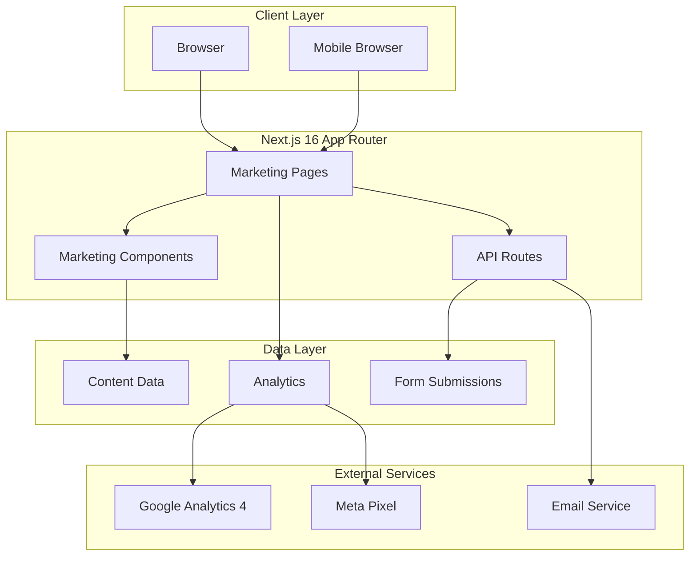

# TENVO Landing Page & Marketing Site Redesign - Design Document

## Overview

### Purpose
This design document outlines the comprehensive redesign of the TENVO landing page and marketing site to transform it into an enterprise-grade marketing platform following best practices from industry leaders like Busy.in, SAP, Oracle, and Microsoft Dynamics.

### Scope
- Complete redesign of 8 marketing pages
- Reusable component library for marketing content
- Enterprise-focused messaging and conversion optimization
- Performance-optimized implementation with Next.js 16 App Router
- SEO and analytics integration
- Mobile-first responsive design

### Goals
1. Increase conversion rates through strategic CTA placement and social proof
2. Clearly communicate TENVO's value proposition to enterprise customers
3. Showcase 55+ domain expertise with industry-specific solutions
4. Highlight Pakistani market features (FBR compliance, Urdu support, local brands)
5. Establish trust through testimonials, metrics, and compliance badges
6. Provide seamless user journey from awareness to trial signup
7. Achieve Core Web Vitals targets (LCP < 2.5s, FID < 100ms, CLS < 0.1)
8. Maintain WCAG 2.1 AA accessibility compliance

### Target Audience
- Pakistani enterprise decision-makers (CFOs, Operations Directors, Business Owners)
- Multi-location business operators (retail chains, manufacturing, wholesale)
- Businesses seeking FBR/SECP compliance automation
- Companies transitioning from manual/legacy systems to modern ERP

### Design Constraints
- Must maintain existing wine brand color (#8B1538)
- Must integrate with existing authentication system
- Must support existing domain knowledge system (55+ domains)
- Must work with current Next.js 16 App Router architecture
- Must be mobile-first and responsive
- Must load in under 2.5 seconds (LCP)
- Must achieve Lighthouse score > 90


## Architecture

### High-Level Architecture



### Technology Stack

| Layer | Technology | Purpose |
|-------|-----------|---------|
| Framework | Next.js 16 App Router | Server-side rendering, routing, optimization |
| React | React 19 | UI components, Server Components |
| Language | JavaScript/TypeScript | Type safety for critical components |
| Styling | Tailwind CSS | Utility-first styling with design system |
| UI Library | shadcn/ui | Pre-built accessible components |
| Icons | Lucide React | Consistent icon system |
| Forms | React Hook Form + Zod | Form validation and submission |
| Analytics | Google Analytics 4 | User behavior tracking |
| SEO | Next.js Metadata API | Meta tags, Open Graph, structured data |
| Performance | Next.js Image | Image optimization and lazy loading |
| Fonts | Next.js Font | Font optimization |

### Design System Integration

The marketing site will use the existing TENVO design system:

- **Primary Color**: Wine (#8B1538)
- **Typography**: System font stack with Geist Sans
- **Spacing**: 8px grid system
- **Border Radius**: Consistent with existing UI (0.75rem default)
- **Shadows**: Elevation system from globals.css
- **Breakpoints**: Tailwind default (sm: 640px, md: 768px, lg: 1024px, xl: 1280px)


### Page Architecture

```
app/
├── page.js                          # Landing page (existing, to be enhanced)
├── features/
│   └── page.js                      # Features page (new)
├── industries/
│   └── page.js                      # Industries page (new)
├── pricing/
│   └── page.js                      # Pricing page (new)
├── about/
│   └── page.js                      # About page (new)
├── contact/
│   └── page.js                      # Contact page (new)
├── demo/
│   └── page.js                      # Demo request page (new)
├── case-studies/
│   ├── page.js                      # Case studies listing (new)
│   └── [slug]/
│       └── page.js                  # Individual case study (new)
└── api/
    └── marketing/
        ├── demo-request/
        │   └── route.js             # Demo request API (new)
        ├── contact/
        │   └── route.js             # Contact form API (new)
        └── newsletter/
            └── route.js             # Newsletter subscription API (new)
```

### Component Architecture

```
components/
└── marketing/                       # New marketing components directory
    ├── layout/
    │   ├── MarketingNav.jsx        # Marketing-specific navigation
    │   ├── MarketingFooter.jsx     # Marketing footer
    │   └── MarketingLayout.jsx     # Wrapper layout for marketing pages
    ├── sections/
    │   ├── Hero.jsx                # Hero section variants
    │   ├── OperationsFlow.jsx      # How it works section
    │   ├── FeaturesGrid.jsx        # Features showcase
    │   ├── DomainShowcase.jsx      # 55+ domains display
    │   ├── PakistaniFeatures.jsx   # Pakistan-specific features
    │   ├── TestimonialsSection.jsx # Customer testimonials
    │   ├── PricingSection.jsx      # Pricing tiers
    │   ├── FAQSection.jsx          # FAQ accordion
    │   ├── CTASection.jsx          # Call-to-action sections
    │   └── StatsBar.jsx            # Trust indicators/stats
    ├── cards/
    │   ├── FeatureCard.jsx         # Individual feature card
    │   ├── TestimonialCard.jsx     # Individual testimonial
    │   ├── PricingCard.jsx         # Pricing tier card
    │   ├── DomainCard.jsx          # Industry/domain card
    │   └── CaseStudyCard.jsx       # Case study preview card
    ├── forms/
    │   ├── DemoRequestForm.jsx     # Demo booking form
    │   ├── ContactForm.jsx         # Contact form
    │   └── NewsletterForm.jsx      # Newsletter subscription
    └── ui/
        ├── TrustBadges.jsx         # Compliance badges
        ├── VideoPlayer.jsx         # Video player component
        └── AnimatedCounter.jsx     # Animated number counter
```


## Components and Interfaces

### Layout Components

#### MarketingNav Component

**Purpose**: Sticky navigation with mega menus, optimized for marketing pages.

**File**: `components/marketing/layout/MarketingNav.jsx`

**Props Interface**:
```javascript
{
  transparent: boolean,        // For hero overlay (default: false)
  currentPage: string,         // Active page for highlighting
  showAuthButtons: boolean     // Show login/signup (default: true)
}
```

**Features**:
- Sticky positioning with backdrop blur on scroll
- Mega menu dropdowns for Solutions and Industries
- Mobile hamburger menu with slide-out drawer
- CTA buttons (Login, Start Free Trial)
- Logo with link to home
- Smooth scroll to sections on same page
- Active state highlighting

**State**:
- `mobileMenuOpen`: boolean
- `expandedMenu`: string | null ('solutions' | 'industries' | null)
- `scrolled`: boolean (for backdrop blur trigger)

**Accessibility**:
- ARIA labels for menu buttons
- Keyboard navigation support
- Focus trap in mobile menu
- Escape key to close menus


#### MarketingFooter Component

**Purpose**: Comprehensive footer with links, contact info, and legal.

**File**: `components/marketing/layout/MarketingFooter.jsx`

**Props Interface**:
```javascript
{
  variant: 'default' | 'minimal'  // Layout variant
}
```

**Features**:
- Multi-column layout (4 columns on desktop, stacked on mobile)
- Logo and company description
- Link sections: Platform, Company, Support, Legal
- Contact information (email, phone)
- Social media links
- Regional links (Pakistan, UAE, Saudi Arabia)
- Newsletter subscription form
- Copyright notice
- Trust badges (SECP, FBR compliant)

**Sections**:
1. Company Info (logo, description, social links)
2. Platform (features, integrations, compliance, security)
3. Company (about, careers, press, contact)
4. Support (help center, documentation, API status, privacy)
5. Newsletter (email subscription)
6. Bottom bar (copyright, regional links, legal links)


### Section Components

#### Hero Component

**Purpose**: Above-the-fold section with value proposition and primary CTA.

**File**: `components/marketing/sections/Hero.jsx`

**Props Interface**:
```javascript
{
  headline: string,
  subheadline: string,
  primaryCTA: {
    text: string,
    href: string,
    onClick: () => void
  },
  secondaryCTA: {
    text: string,
    href: string,
    onClick: () => void
  },
  stats: Array<{
    value: string,
    label: string,
    icon: ReactNode
  }>,
  heroImage: string,
  heroImageAlt: string,
  variant: 'default' | 'centered' | 'split',
  badge: {
    text: string,
    icon: ReactNode
  }
}
```

**Variants**:
- `default`: Split layout with text left, image right
- `centered`: Centered text with background image
- `split`: 50/50 split with equal emphasis

**Features**:
- Gradient background with decorative blur elements
- Large headline with brand color accent
- Subheadline with max-width for readability
- Two CTA buttons with distinct styling
- Trust indicators bar (stats)
- Hero image with floating UI elements overlay
- Responsive layout (stacked on mobile)
- Animated entrance (fade-in, slide-up)

**Performance**:
- Hero image uses Next.js Image with priority loading
- Above-the-fold content rendered server-side
- Decorative elements use CSS (no images)


#### FeaturesGrid Component

**Purpose**: Showcase key features in a grid layout.

**File**: `components/marketing/sections/FeaturesGrid.jsx`

**Props Interface**:
```javascript
{
  title: string,
  subtitle: string,
  features: Array<{
    id: string,
    icon: string,           // Lucide icon name
    title: string,
    description: string,
    link: string
  }>,
  columns: 2 | 3 | 4,      // Grid columns on desktop
  variant: 'cards' | 'list'
}
```

**Features**:
- Responsive grid (1 col mobile, 2 col tablet, 3-4 col desktop)
- Section header with title and subtitle
- Feature cards with icons, titles, descriptions
- Optional links to feature detail pages
- Hover effects on cards
- Consistent spacing and alignment

**Card Hover Effects**:
- Shadow elevation increase
- Slight translate up (-2px)
- Icon background color change to brand color
- Smooth transitions (300ms)


#### DomainShowcase Component

**Purpose**: Display 55+ industry domains with filtering and search.

**File**: `components/marketing/sections/DomainShowcase.jsx`

**Props Interface**:
```javascript
{
  title: string,
  subtitle: string,
  domains: Array<{
    slug: string,
    name: string,
    icon: string,
    category: string,
    description: string
  }>,
  showSearch: boolean,
  showFilters: boolean,
  initialDisplay: number,    // Number to show initially
  ctaText: string,
  ctaHref: string
}
```

**Features**:
- Grid layout (2 cols mobile, 4 cols tablet, 6 cols desktop)
- Search bar for filtering domains
- Category filters (Retail, Manufacturing, Services, etc.)
- "Show more" button for progressive disclosure
- Domain cards with icons and names
- Links to domain-specific signup or info pages
- Hover effects with underline animation

**State**:
- `searchQuery`: string
- `selectedCategory`: string | null
- `displayCount`: number
- `filteredDomains`: Array

**Performance**:
- Initial render shows 12 domains
- Lazy load additional domains on "Show more" click
- Debounced search (300ms)
- Memoized filtering logic


#### PakistaniFeatures Component

**Purpose**: Highlight Pakistan-specific competitive advantages.

**File**: `components/marketing/sections/PakistaniFeatures.jsx`

**Props Interface**:
```javascript
{
  title: string,
  subtitle: string,
  features: Array<{
    icon: string,
    title: string,
    description: string,
    badge: string          // e.g., "Exclusive"
  }>,
  layout: 'grid' | 'list' | 'highlight'
}
```

**Key Features to Highlight**:
1. **FBR Tier-1 Compliance**
   - Automated tax filing
   - Invoice generation
   - Sales tax returns
   - Withholding tax calculations

2. **Urdu Language Support**
   - Full RTL support
   - Nastaliq typography
   - Bilingual interface
   - Urdu reports

3. **Local Brand Integration**
   - Pakistani supplier database
   - Local brand autocomplete
   - Market-specific pricing
   - Regional warehouse support

4. **Pakistani Payment Methods**
   - JazzCash integration
   - EasyPaisa support
   - Bank transfer templates
   - Cash on delivery

5. **Regional Markets**
   - City-specific market data
   - Local business hours
   - Regional holidays
   - Provincial tax variations

**Visual Treatment**:
- Prominent section with brand color background or border
- Large icons with Pakistan flag accent
- "Built for Pakistan" badge
- Trust indicators (FBR logo, SECP certification)


#### TestimonialsSection Component

**Purpose**: Display customer testimonials with social proof.

**File**: `components/marketing/sections/TestimonialsSection.jsx`

**Props Interface**:
```javascript
{
  title: string,
  subtitle: string,
  testimonials: Array<{
    id: string,
    quote: string,
    author: string,
    role: string,
    company: string,
    avatar: string,
    rating: number,
    industry: string
  }>,
  layout: 'grid' | 'carousel' | 'featured',
  showRatings: boolean,
  showIndustry: boolean
}
```

**Layouts**:
- `grid`: 3-column grid on desktop, stacked on mobile
- `carousel`: Horizontal scrolling carousel with navigation
- `featured`: One large testimonial with smaller ones below

**Features**:
- Quote icon
- Testimonial text (italic, large font)
- Author name, role, and company
- Optional avatar image
- Optional star rating
- Industry badge
- Card hover effects
- Responsive layout

**Visual Design**:
- White cards on colored background (wine or gray)
- Or colored cards (wine with white text) on white background
- Subtle shadows and borders
- Quote marks as decorative element


#### PricingSection Component

**Purpose**: Display pricing tiers with feature comparison.

**File**: `components/marketing/sections/PricingSection.jsx`

**Props Interface**:
```javascript
{
  title: string,
  subtitle: string,
  tiers: Array<{
    id: string,
    name: string,
    price: {
      amount: number | null,  // null for custom pricing
      currency: string,
      period: string
    },
    features: Array<string>,
    highlighted: boolean,
    badge: string,
    ctaText: string,
    ctaHref: string
  }>,
  billingToggle: boolean,      // Show monthly/annual toggle
  annualDiscount: number,      // Percentage discount for annual
  showComparison: boolean      // Show detailed feature comparison table
}
```

**Features**:
- Billing period toggle (monthly/annual)
- 3 pricing tiers (Starter, Professional, Enterprise)
- Highlighted "Most Popular" tier
- Feature lists with checkmarks
- CTA buttons
- "Custom pricing" for Enterprise
- Feature comparison table (optional)
- Trust indicators ("No credit card required", "Cancel anytime")

**Pricing Tiers**:
1. **Starter** (Free)
   - Up to 100 products
   - 1 user account
   - Basic inventory tracking
   - Email support

2. **Professional** (PKR 4,999/month)
   - Unlimited products
   - 5 user accounts
   - Multi-warehouse support
   - FBR compliance automation
   - Priority support
   - **Most Popular**

3. **Enterprise** (Custom)
   - Everything in Professional
   - Unlimited users
   - Custom integrations
   - Dedicated account manager
   - 24/7 phone support
   - SLA guarantee


### Card Components

#### FeatureCard Component

**Purpose**: Reusable card for displaying individual features.

**File**: `components/marketing/cards/FeatureCard.jsx`

**Props Interface**:
```javascript
{
  icon: ReactNode | string,    // Lucide icon component or name
  title: string,
  description: string,
  link: string,
  linkText: string,
  variant: 'default' | 'highlighted' | 'minimal'
}
```

**Features**:
- Icon with background (changes color on hover)
- Title (bold, large)
- Description (gray, medium)
- Optional "Learn more" link
- Hover effects (shadow, translate, icon color)
- Consistent padding and spacing

**Variants**:
- `default`: White card with border
- `highlighted`: Brand color background with white text
- `minimal`: No border, transparent background

**Accessibility**:
- Semantic HTML (article or div)
- Proper heading hierarchy
- Link with descriptive text
- Sufficient color contrast


#### PricingCard Component

**Purpose**: Display individual pricing tier.

**File**: `components/marketing/cards/PricingCard.jsx`

**Props Interface**:
```javascript
{
  name: string,
  price: {
    amount: number | null,
    currency: string,
    period: string
  },
  features: Array<string>,
  highlighted: boolean,
  badge: string,
  ctaText: string,
  ctaHref: string,
  popular: boolean
}
```

**Features**:
- Tier name and optional badge
- Price display (large, prominent)
- "Custom pricing" text for null amount
- Feature list with checkmarks
- CTA button (full width)
- Highlighted variant (border, shadow, scale)
- "Most Popular" badge for recommended tier

**Visual Treatment**:
- Highlighted card: Larger scale (105%), thicker border, brand color accent
- Regular card: White background, gray border
- Hover: Shadow elevation increase
- CTA button: Brand color for highlighted, outline for others


### Form Components

#### DemoRequestForm Component

**Purpose**: Capture demo booking requests with validation.

**File**: `components/marketing/forms/DemoRequestForm.jsx`

**Props Interface**:
```javascript
{
  onSubmit: (data) => Promise<void>,
  submitText: string,
  showDatePicker: boolean,
  showIndustrySelector: boolean
}
```

**Form Fields**:
```javascript
{
  name: string,              // Required
  email: string,             // Required, email validation
  phone: string,             // Required, Pakistani phone format
  company: string,           // Required
  industry: string,          // Required, dropdown from domains
  message: string,           // Optional, textarea
  preferredDate: Date,       // Optional, date picker
  preferredTime: string,     // Optional, time slots
  agreeToTerms: boolean      // Required, checkbox
}
```

**Validation Rules**:
- Name: Min 2 characters, max 100 characters
- Email: Valid email format
- Phone: Pakistani format (+92 or 03XX)
- Company: Min 2 characters
- Industry: Must select from list
- Terms: Must be checked

**Features**:
- Real-time validation with error messages
- Loading state during submission
- Success message with confirmation
- Error handling with user-friendly messages
- Accessible form labels and ARIA attributes
- Keyboard navigation support
- Auto-focus on first field

**Submission Flow**:
1. Validate all fields
2. Show loading state
3. Call API endpoint
4. On success: Show success message, clear form, track event
5. On error: Show error message, keep form data


#### ContactForm Component

**Purpose**: General contact form for inquiries.

**File**: `components/marketing/forms/ContactForm.jsx`

**Props Interface**:
```javascript
{
  onSubmit: (data) => Promise<void>,
  submitText: string,
  showSubject: boolean
}
```

**Form Fields**:
```javascript
{
  name: string,              // Required
  email: string,             // Required
  phone: string,             // Optional
  subject: string,           // Optional, dropdown
  message: string,           // Required, textarea
  agreeToTerms: boolean      // Required
}
```

**Subject Options**:
- General Inquiry
- Sales Question
- Technical Support
- Partnership Opportunity
- Media/Press
- Other

**Features**:
- Similar validation and submission flow as DemoRequestForm
- Character counter for message field (max 1000 characters)
- Auto-resize textarea
- Spam protection (honeypot field)


## Data Models

### Marketing Content Structure

**File**: `lib/marketing/content.js`

```javascript
export const marketingContent = {
  // Hero section content
  hero: {
    headline: "The Intelligent Operating System for Pakistan",
    subheadline: "Unified financial infrastructure for the modern enterprise. Scale your inventory, accounting, and compliance with bank-grade precision.",
    primaryCTA: {
      text: "Start Building",
      href: "/register"
    },
    secondaryCTA: {
      text: "Schedule Demo",
      href: "/demo"
    },
    badge: {
      text: "V4.0 Enterprise Edition",
      icon: "Rocket"
    },
    stats: [
      { value: "450k+", label: "Active Users", icon: "Users" },
      { value: "99.9%", label: "Core Uptime", icon: "Activity" },
      { value: "SECP", label: "Compliant", icon: "Shield" }
    ],
    heroImage: "/industrial_hero_image.png",
    heroImageAlt: "TENVO Inventory and Operations Dashboard"
  },

  // Features content
  features: [
    {
      id: "inventory",
      icon: "Package",
      title: "Inventory Intelligence",
      description: "Real-time multi-warehouse tracking with AI-driven stock predictions and low-stock alerts.",
      link: "/features#inventory"
    },
    {
      id: "compliance",
      icon: "Receipt",
      title: "Automated Compliance",
      description: "Stay 100% compliant with FBR Tier-1, SRB, and PRA regulations automatically.",
      link: "/features#compliance"
    },
    {
      id: "analytics",
      icon: "PieChart",
      title: "Advanced Analytics",
      description: "Instant P&L, Balance Sheets, and Cash Flow statements with granular drill-down capacity.",
      link: "/features#analytics"
    },
    {
      id: "multi-location",
      icon: "Store",
      title: "Scale Everywhere",
      description: "Manage hundreds of branches, outlets, and depots from a single global control center.",
      link: "/features#multi-location"
    },
    {
      id: "security",
      icon: "Shield",
      title: "Identity & Security",
      description: "Zero-trust security architecture with role-based access and immutable audit trails.",
      link: "/features#security"
    },
    {
      id: "cloud",
      icon: "Cloud",
      title: "Cloud Infrastructure",
      description: "High-availability server network ensuring your business stays online 24/7/365.",
      link: "/features#cloud"
    }
  ],

  // Operations flow (How it works)
  operationsFlow: {
    title: "One flow. Full control.",
    subtitle: "From receiving stock to financial close, every movement stays connected, auditable, and real-time.",
    steps: [
      {
        id: "capture",
        icon: "Package",
        title: "Capture",
        description: "Create products, batches, serials, and warehouse locations with enterprise-grade validation."
      },
      {
        id: "operate",
        icon: "TrendingUp",
        title: "Operate",
        description: "Run reservations, transfers, adjustments, and auto-reorder from a single operational cockpit."
      },
      {
        id: "control",
        icon: "Shield",
        title: "Control",
        description: "Maintain audit-ready traceability with role-based permissions and compliance-first workflows."
      }
    ]
  },

  // Pakistani features
  pakistaniFeatures: {
    title: "Built for Pakistan",
    subtitle: "Localized features that give you a competitive edge in the Pakistani market.",
    features: [
      {
        icon: "Receipt",
        title: "FBR Tier-1 Compliance",
        description: "Automated tax filing, invoice generation, and sales tax returns. Stay compliant without the paperwork.",
        badge: "Exclusive"
      },
      {
        icon: "Globe",
        title: "Urdu Language Support",
        description: "Full RTL support with Nastaliq typography. Generate reports and invoices in Urdu.",
        badge: "Exclusive"
      },
      {
        icon: "Building2",
        title: "Local Brand Integration",
        description: "Pre-configured database of Pakistani suppliers, brands, and market-specific pricing.",
        badge: "Exclusive"
      },
      {
        icon: "CreditCard",
        title: "Pakistani Payment Methods",
        description: "JazzCash, EasyPaisa, and local bank integrations built-in.",
        badge: "Exclusive"
      }
    ]
  }
};
```


### Testimonials Data Model

**File**: `lib/marketing/testimonials.js`

```javascript
export const testimonials = [
  {
    id: "testimonial-1",
    quote: "The most intuitive ERP we've ever used. It streamlined our entire supply chain within months.",
    author: "Ibrahim Mansoor",
    role: "Director",
    company: "Mansoor Textiles",
    avatar: "/images/testimonials/ibrahim.jpg",
    rating: 5,
    industry: "Textile Manufacturing"
  },
  {
    id: "testimonial-2",
    quote: "TENVO's tax automation saved our accounting team hundreds of hours every quarter.",
    author: "Sara Ahmed",
    role: "CFO",
    company: "Nexus Logistics",
    avatar: "/images/testimonials/sara.jpg",
    rating: 5,
    industry: "Logistics"
  },
  {
    id: "testimonial-3",
    quote: "Finally, a platform that scales with us. Managing 20+ retail locations is now effortless.",
    author: "Kamran Malik",
    role: "Founder",
    company: "Malik Mart",
    avatar: "/images/testimonials/kamran.jpg",
    rating: 5,
    industry: "Retail"
  }
];

export function getTestimonialsByIndustry(industry) {
  return testimonials.filter(t => t.industry === industry);
}

export function getFeaturedTestimonials(count = 3) {
  return testimonials.slice(0, count);
}
```


### Pricing Data Model

**File**: `lib/marketing/pricing.js`

```javascript
export const pricingTiers = [
  {
    id: "starter",
    name: "Starter",
    price: {
      amount: 0,
      currency: "PKR",
      period: "month"
    },
    features: [
      "Up to 100 products",
      "1 user account",
      "Basic inventory tracking",
      "Email support",
      "Mobile app access"
    ],
    ctaText: "Start Free",
    ctaHref: "/register?plan=starter",
    highlighted: false,
    popular: false
  },
  {
    id: "professional",
    name: "Professional",
    price: {
      amount: 4999,
      currency: "PKR",
      period: "month"
    },
    annualPrice: {
      amount: 47990,  // 20% discount
      currency: "PKR",
      period: "year"
    },
    features: [
      "Unlimited products",
      "5 user accounts",
      "Multi-warehouse support",
      "FBR compliance automation",
      "Priority support",
      "Advanced analytics",
      "API access",
      "Custom reports"
    ],
    ctaText: "Start Trial",
    ctaHref: "/register?plan=professional",
    highlighted: true,
    popular: true,
    badge: "Most Popular"
  },
  {
    id: "enterprise",
    name: "Enterprise",
    price: {
      amount: null,  // Custom pricing
      currency: "PKR",
      period: "month"
    },
    features: [
      "Everything in Professional",
      "Unlimited users",
      "Custom integrations",
      "Dedicated account manager",
      "24/7 phone support",
      "SLA guarantee",
      "On-premise deployment option",
      "Custom training",
      "White-label options"
    ],
    ctaText: "Contact Sales",
    ctaHref: "/contact?plan=enterprise",
    highlighted: false,
    popular: false
  }
];

export function getPricingTier(id) {
  return pricingTiers.find(tier => tier.id === id);
}

export function calculateAnnualSavings(monthlyAmount) {
  const annualMonthly = monthlyAmount * 12;
  const annualDiscounted = annualMonthly * 0.8;  // 20% discount
  return annualMonthly - annualDiscounted;
}
```


### Case Studies Data Model

**File**: `lib/marketing/case-studies.js`

```javascript
export const caseStudies = [
  {
    id: "mansoor-textiles",
    slug: "mansoor-textiles",
    company: "Mansoor Textiles",
    industry: "Textile Manufacturing",
    logo: "/images/case-studies/mansoor-logo.png",
    heroImage: "/images/case-studies/mansoor-hero.jpg",
    summary: "How Mansoor Textiles reduced stock discrepancies by 40% and saved PKR 2M annually.",
    challenge: "Managing inventory across 5 warehouses with manual processes led to frequent stock discrepancies, delayed orders, and significant financial losses.",
    solution: "Implemented TENVO's multi-warehouse system with batch tracking, automated reordering, and real-time inventory synchronization across all locations.",
    results: [
      { metric: "40%", label: "Reduction in stock discrepancies" },
      { metric: "60%", label: "Faster order processing" },
      { metric: "PKR 2M", label: "Annual cost savings" }
    ],
    testimonial: {
      quote: "TENVO transformed our operations. We now have complete visibility across all warehouses and can make data-driven decisions in real-time.",
      author: "Ibrahim Mansoor",
      role: "Director",
      avatar: "/images/testimonials/ibrahim.jpg"
    },
    features: [
      "Multi-warehouse inventory management",
      "Batch tracking and traceability",
      "Automated reorder points",
      "Real-time synchronization",
      "Custom reporting"
    ],
    publishedDate: "2024-01-15",
    readTime: "5 min"
  }
  // More case studies...
];

export function getCaseStudy(slug) {
  return caseStudies.find(cs => cs.slug === slug);
}

export function getCaseStudiesByIndustry(industry) {
  return caseStudies.filter(cs => cs.industry === industry);
}

export function getFeaturedCaseStudies(count = 3) {
  return caseStudies.slice(0, count);
}
```


### FAQ Data Model

**File**: `lib/marketing/faqs.js`

```javascript
export const faqs = [
  {
    id: "what-is-tenvo",
    question: "What is TENVO?",
    answer: "TENVO is a comprehensive ERP system designed specifically for Pakistani businesses. It combines inventory management, accounting, compliance, and multi-location operations into a single, unified platform.",
    category: "General"
  },
  {
    id: "fbr-compliance",
    question: "How does TENVO handle FBR compliance?",
    answer: "TENVO automatically generates FBR-compliant invoices, calculates sales tax, and prepares tax returns. Our system is certified for FBR Tier-1 compliance and stays updated with the latest tax regulations.",
    category: "Compliance"
  },
  {
    id: "pricing",
    question: "What are the pricing plans?",
    answer: "We offer three plans: Starter (free for up to 100 products), Professional (PKR 4,999/month), and Enterprise (custom pricing). All plans include core features, with Professional and Enterprise adding advanced capabilities.",
    category: "Pricing"
  },
  {
    id: "trial",
    question: "Is there a free trial?",
    answer: "Yes! Our Professional plan includes a 14-day free trial with full access to all features. No credit card required to start.",
    category: "Pricing"
  },
  {
    id: "data-security",
    question: "How secure is my data?",
    answer: "We use bank-grade encryption (AES-256) for data at rest and TLS 1.3 for data in transit. Our infrastructure is hosted on secure cloud servers with daily backups and 99.9% uptime SLA.",
    category: "Security"
  },
  {
    id: "multi-location",
    question: "Can I manage multiple locations?",
    answer: "Yes! TENVO supports unlimited locations on Professional and Enterprise plans. You can manage inventory, sales, and operations across all your branches from a single dashboard.",
    category: "Features"
  },
  {
    id: "urdu-support",
    question: "Does TENVO support Urdu?",
    answer: "Yes! TENVO includes full Urdu language support with RTL interface, Nastaliq typography, and the ability to generate reports and invoices in Urdu.",
    category: "Features"
  },
  {
    id: "migration",
    question: "Can I migrate from my current system?",
    answer: "Yes! We provide free data migration assistance for Professional and Enterprise customers. Our team will help you import your existing data from Excel, other ERP systems, or manual records.",
    category: "Support"
  }
];

export function getFAQsByCategory(category) {
  return faqs.filter(faq => faq.category === category);
}

export function searchFAQs(query) {
  const lowerQuery = query.toLowerCase();
  return faqs.filter(faq => 
    faq.question.toLowerCase().includes(lowerQuery) ||
    faq.answer.toLowerCase().includes(lowerQuery)
  );
}
```


## API Endpoints

### Demo Request API

**Endpoint**: `POST /api/marketing/demo-request`

**File**: `app/api/marketing/demo-request/route.js`

**Request Body**:
```javascript
{
  name: string,              // Required
  email: string,             // Required
  phone: string,             // Required
  company: string,           // Required
  industry: string,          // Required
  message: string,           // Optional
  preferredDate: string,     // Optional (ISO date)
  preferredTime: string      // Optional
}
```

**Response**:
```javascript
{
  success: boolean,
  message: string,
  requestId: string          // UUID for tracking
}
```

**Implementation**:
```javascript
export async function POST(request) {
  try {
    const data = await request.json();
    
    // Validate input
    const validation = validateDemoRequest(data);
    if (!validation.valid) {
      return Response.json(
        { success: false, message: validation.error },
        { status: 400 }
      );
    }
    
    // Store in database
    const requestId = await storeDemoRequest(data);
    
    // Send confirmation email to user
    await sendDemoConfirmationEmail(data.email, data.name);
    
    // Notify sales team
    await notifySalesTeam(data);
    
    // Track conversion event
    trackEvent('demo_request', {
      industry: data.industry,
      company: data.company
    });
    
    return Response.json({
      success: true,
      message: "Demo request received! We'll contact you within 24 hours.",
      requestId
    });
  } catch (error) {
    console.error('Demo request error:', error);
    return Response.json(
      { success: false, message: "An error occurred. Please try again." },
      { status: 500 }
    );
  }
}
```


### Contact Form API

**Endpoint**: `POST /api/marketing/contact`

**File**: `app/api/marketing/contact/route.js`

**Request Body**:
```javascript
{
  name: string,              // Required
  email: string,             // Required
  phone: string,             // Optional
  subject: string,           // Optional
  message: string,           // Required
}
```

**Response**:
```javascript
{
  success: boolean,
  message: string,
  ticketId: string           // Support ticket ID
}
```

**Implementation**: Similar to demo request API with support ticket creation.

### Newsletter Subscription API

**Endpoint**: `POST /api/marketing/newsletter`

**File**: `app/api/marketing/newsletter/route.js`

**Request Body**:
```javascript
{
  email: string              // Required
}
```

**Response**:
```javascript
{
  success: boolean,
  message: string
}
```

**Implementation**:
- Validate email format
- Check for existing subscription
- Add to mailing list (e.g., Mailchimp, SendGrid)
- Send welcome email
- Track subscription event


## SEO Strategy

### Meta Tags Structure

Each page will include comprehensive meta tags using Next.js Metadata API:

```javascript
// Example: app/page.js
export const metadata = {
  title: "TENVO - Enterprise ERP for Pakistani Businesses | Inventory, Accounting, Compliance",
  description: "The intelligent operating system for Pakistan. Unified financial infrastructure with FBR compliance, multi-warehouse inventory, and automated accounting. Trusted by 450k+ users.",
  keywords: [
    "ERP Pakistan",
    "Inventory Management Pakistan",
    "FBR Compliance Software",
    "Accounting Software Pakistan",
    "POS System Pakistan",
    "Multi-warehouse Management",
    "Pakistani Business Software"
  ],
  authors: [{ name: "TENVO" }],
  openGraph: {
    title: "TENVO - Enterprise ERP for Pakistani Businesses",
    description: "Unified financial infrastructure for modern enterprises. FBR compliant, multi-warehouse, automated accounting.",
    url: "https://tenvo.com",
    siteName: "TENVO",
    images: [
      {
        url: "/images/og-image.jpg",
        width: 1200,
        height: 630,
        alt: "TENVO Enterprise ERP Dashboard"
      }
    ],
    locale: "en_PK",
    type: "website"
  },
  twitter: {
    card: "summary_large_image",
    title: "TENVO - Enterprise ERP for Pakistani Businesses",
    description: "Unified financial infrastructure for modern enterprises.",
    images: ["/images/twitter-image.jpg"],
    creator: "@tenvo"
  },
  robots: {
    index: true,
    follow: true,
    googleBot: {
      index: true,
      follow: true,
      "max-video-preview": -1,
      "max-image-preview": "large",
      "max-snippet": -1
    }
  },
  verification: {
    google: "google-site-verification-code",
    yandex: "yandex-verification-code"
  }
};
```


### Structured Data (JSON-LD)

Implement structured data for better search engine understanding:

```javascript
// lib/marketing/structured-data.js

export function getOrganizationSchema() {
  return {
    "@context": "https://schema.org",
    "@type": "Organization",
    "name": "TENVO",
    "url": "https://tenvo.com",
    "logo": "https://tenvo.com/logo.png",
    "description": "Enterprise ERP system for Pakistani businesses",
    "address": {
      "@type": "PostalAddress",
      "addressCountry": "PK",
      "addressLocality": "Karachi"
    },
    "contactPoint": {
      "@type": "ContactPoint",
      "telephone": "+92-XXX-XXXXXXX",
      "contactType": "Customer Service",
      "areaServed": "PK",
      "availableLanguage": ["en", "ur"]
    },
    "sameAs": [
      "https://facebook.com/tenvo",
      "https://twitter.com/tenvo",
      "https://linkedin.com/company/tenvo"
    ]
  };
}

export function getSoftwareApplicationSchema() {
  return {
    "@context": "https://schema.org",
    "@type": "SoftwareApplication",
    "name": "TENVO",
    "applicationCategory": "BusinessApplication",
    "operatingSystem": "Web, iOS, Android",
    "offers": {
      "@type": "Offer",
      "price": "0",
      "priceCurrency": "PKR"
    },
    "aggregateRating": {
      "@type": "AggregateRating",
      "ratingValue": "4.8",
      "ratingCount": "1250"
    }
  };
}

export function getFAQSchema(faqs) {
  return {
    "@context": "https://schema.org",
    "@type": "FAQPage",
    "mainEntity": faqs.map(faq => ({
      "@type": "Question",
      "name": faq.question,
      "acceptedAnswer": {
        "@type": "Answer",
        "text": faq.answer
      }
    }))
  };
}
```


## Analytics and Tracking

### Analytics Implementation

**File**: `lib/analytics/tracking.js`

```javascript
// Google Analytics 4 tracking
export const GA_MEASUREMENT_ID = process.env.NEXT_PUBLIC_GA_ID;

export const trackPageView = (url) => {
  if (typeof window !== 'undefined' && window.gtag) {
    window.gtag('config', GA_MEASUREMENT_ID, {
      page_path: url,
    });
  }
};

export const trackEvent = (eventName, eventData = {}) => {
  // Google Analytics 4
  if (typeof window !== 'undefined' && window.gtag) {
    window.gtag('event', eventName, eventData);
  }
  
  // Meta Pixel
  if (typeof window !== 'undefined' && window.fbq) {
    window.fbq('track', eventName, eventData);
  }
  
  // Console log in development
  if (process.env.NODE_ENV === 'development') {
    console.log('Track Event:', eventName, eventData);
  }
};

// Predefined event types
export const EVENTS = {
  // Page events
  PAGE_VIEW: 'page_view',
  
  // CTA events
  CTA_CLICK: 'cta_click',
  HERO_CTA_CLICK: 'hero_cta_click',
  PRICING_CTA_CLICK: 'pricing_cta_click',
  
  // Form events
  FORM_START: 'form_start',
  FORM_SUBMIT: 'form_submit',
  FORM_ERROR: 'form_error',
  
  // Conversion events
  DEMO_REQUEST: 'demo_request',
  TRIAL_START: 'trial_start',
  CONTACT_SUBMIT: 'contact_submit',
  NEWSLETTER_SUBSCRIBE: 'newsletter_subscribe',
  
  // Engagement events
  PRICING_VIEW: 'pricing_view',
  FEATURE_EXPLORE: 'feature_explore',
  VIDEO_PLAY: 'video_play',
  VIDEO_COMPLETE: 'video_complete',
  DOWNLOAD: 'download',
  
  // Navigation events
  NAV_MENU_OPEN: 'nav_menu_open',
  DOMAIN_CARD_CLICK: 'domain_card_click',
  
  // Scroll events
  SCROLL_DEPTH: 'scroll_depth'
};

// Track CTA clicks
export const trackCTAClick = (ctaLocation, ctaText, ctaHref) => {
  trackEvent(EVENTS.CTA_CLICK, {
    cta_location: ctaLocation,
    cta_text: ctaText,
    cta_href: ctaHref
  });
};

// Track form submissions
export const trackFormSubmit = (formType, formData = {}) => {
  trackEvent(EVENTS.FORM_SUBMIT, {
    form_type: formType,
    ...formData
  });
};

// Track scroll depth
export const trackScrollDepth = (depth) => {
  trackEvent(EVENTS.SCROLL_DEPTH, {
    scroll_depth: depth
  });
};
```


### Scroll Depth Tracking

**File**: `hooks/useScrollDepth.js`

```javascript
import { useEffect, useRef } from 'react';
import { trackScrollDepth } from '@/lib/analytics/tracking';

export function useScrollDepth() {
  const trackedDepths = useRef(new Set());
  
  useEffect(() => {
    const handleScroll = () => {
      const windowHeight = window.innerHeight;
      const documentHeight = document.documentElement.scrollHeight;
      const scrollTop = window.scrollY;
      const scrollPercentage = (scrollTop / (documentHeight - windowHeight)) * 100;
      
      // Track at 25%, 50%, 75%, 100%
      const depths = [25, 50, 75, 100];
      depths.forEach(depth => {
        if (scrollPercentage >= depth && !trackedDepths.current.has(depth)) {
          trackedDepths.current.add(depth);
          trackScrollDepth(depth);
        }
      });
    };
    
    window.addEventListener('scroll', handleScroll, { passive: true });
    return () => window.removeEventListener('scroll', handleScroll);
  }, []);
}
```

### Key Tracking Points

1. **Page Views**: All marketing pages
2. **CTA Clicks**: All call-to-action buttons
3. **Form Interactions**:
   - Form start (first field focus)
   - Form submit (success/error)
   - Field errors
4. **Conversion Events**:
   - Demo requests
   - Trial signups
   - Contact form submissions
   - Newsletter subscriptions
5. **Engagement**:
   - Pricing page views
   - Feature card clicks
   - Video plays and completions
   - Domain card clicks
6. **Scroll Depth**: 25%, 50%, 75%, 100%
7. **Time on Page**: Automatic with GA4


## Performance Optimization

### Core Web Vitals Targets

| Metric | Target | Strategy |
|--------|--------|----------|
| LCP (Largest Contentful Paint) | < 2.5s | Image optimization, server components, CDN |
| FID (First Input Delay) | < 100ms | Code splitting, minimal JavaScript |
| CLS (Cumulative Layout Shift) | < 0.1 | Fixed dimensions, font optimization |
| TTFB (Time to First Byte) | < 600ms | Edge caching, server optimization |

### Image Optimization

**Strategy**:
1. Use Next.js Image component for all images
2. Serve images in WebP format with JPEG fallback
3. Implement lazy loading for below-the-fold images
4. Use `priority` prop for hero images
5. Optimize image sizes for different breakpoints

**Example**:
```javascript
import Image from 'next/image';

<Image
  src="/industrial_hero_image.png"
  alt="TENVO Dashboard"
  width={1200}
  height={900}
  priority  // For hero images
  quality={85}
  placeholder="blur"
  blurDataURL="data:image/jpeg;base64,..."
/>
```

### Code Splitting

**Strategy**:
1. Use dynamic imports for heavy components
2. Lazy load below-the-fold sections
3. Split marketing components from app components
4. Use React.lazy for client components

**Example**:
```javascript
import dynamic from 'next/dynamic';

const VideoPlayer = dynamic(() => import('@/components/marketing/ui/VideoPlayer'), {
  loading: () => <div className="animate-pulse bg-gray-200 h-64" />,
  ssr: false  // Client-side only
});
```


### Font Optimization

**Strategy**:
1. Use Next.js Font optimization
2. Preload critical fonts
3. Use system fonts as fallback
4. Subset fonts to reduce file size

**Implementation**:
```javascript
// app/layout.js
import { Inter } from 'next/font/google';

const inter = Inter({
  subsets: ['latin'],
  display: 'swap',
  variable: '--font-inter'
});

export default function RootLayout({ children }) {
  return (
    <html lang="en" className={inter.variable}>
      <body>{children}</body>
    </html>
  );
}
```

### Caching Strategy

**Static Pages** (Build-time generation):
- Landing page
- Features page
- Industries page
- Pricing page
- About page

**Dynamic Pages** (ISR - Incremental Static Regeneration):
- Case studies (revalidate every 24 hours)
- Blog posts (if added)

**API Routes** (No caching):
- Form submissions
- Newsletter subscriptions

**CDN Caching**:
- Images: 1 year
- Static assets: 1 year
- HTML pages: 1 hour


## Accessibility

### WCAG 2.1 AA Compliance

**Requirements**:
1. **Perceivable**:
   - All images have alt text
   - Color contrast ratio ≥ 4.5:1 for normal text
   - Color contrast ratio ≥ 3:1 for large text
   - No information conveyed by color alone

2. **Operable**:
   - All functionality available via keyboard
   - No keyboard traps
   - Skip to main content link
   - Focus indicators visible
   - Sufficient time for interactions

3. **Understandable**:
   - Clear, consistent navigation
   - Form labels and instructions
   - Error messages and suggestions
   - Predictable behavior

4. **Robust**:
   - Valid HTML
   - ARIA attributes where needed
   - Compatible with assistive technologies

### Implementation Checklist

**Navigation**:
- [ ] Keyboard navigation support (Tab, Enter, Escape)
- [ ] ARIA labels for menu buttons
- [ ] Focus trap in mobile menu
- [ ] Skip to main content link

**Forms**:
- [ ] Label for every input
- [ ] Error messages with aria-describedby
- [ ] Required fields marked with aria-required
- [ ] Form validation messages announced to screen readers

**Images**:
- [ ] Descriptive alt text for all images
- [ ] Decorative images with empty alt=""
- [ ] Complex images with detailed descriptions

**Interactive Elements**:
- [ ] Buttons have descriptive text or aria-label
- [ ] Links have descriptive text
- [ ] Focus indicators visible (outline or custom)
- [ ] Touch targets ≥ 44x44px

**Color and Contrast**:
- [ ] Text contrast ≥ 4.5:1 (normal text)
- [ ] Text contrast ≥ 3:1 (large text ≥18pt)
- [ ] Interactive elements contrast ≥ 3:1
- [ ] No information by color alone


### Keyboard Navigation

**Implementation**:
```javascript
// Example: Accessible dropdown menu
function DropdownMenu({ items }) {
  const [isOpen, setIsOpen] = useState(false);
  const menuRef = useRef(null);
  
  const handleKeyDown = (e) => {
    switch (e.key) {
      case 'Escape':
        setIsOpen(false);
        break;
      case 'ArrowDown':
        e.preventDefault();
        // Focus next item
        break;
      case 'ArrowUp':
        e.preventDefault();
        // Focus previous item
        break;
    }
  };
  
  return (
    <div>
      <button
        onClick={() => setIsOpen(!isOpen)}
        onKeyDown={handleKeyDown}
        aria-expanded={isOpen}
        aria-haspopup="true"
      >
        Menu
      </button>
      {isOpen && (
        <ul
          ref={menuRef}
          role="menu"
          onKeyDown={handleKeyDown}
        >
          {items.map(item => (
            <li key={item.id} role="menuitem">
              <a href={item.href}>{item.text}</a>
            </li>
          ))}
        </ul>
      )}
    </div>
  );
}
```

### Screen Reader Support

**ARIA Landmarks**:
```html
<header role="banner">
  <nav role="navigation" aria-label="Main navigation">
    <!-- Navigation content -->
  </nav>
</header>

<main role="main">
  <!-- Main content -->
</main>

<footer role="contentinfo">
  <!-- Footer content -->
</footer>
```

**Live Regions** (for dynamic content):
```javascript
<div
  role="status"
  aria-live="polite"
  aria-atomic="true"
>
  {successMessage}
</div>
```


## Error Handling

### Form Error Handling

**Strategy**:
1. Client-side validation with immediate feedback
2. Server-side validation for security
3. User-friendly error messages
4. Preserve form data on error
5. Focus on first error field

**Implementation**:
```javascript
// Example: Form error handling
function DemoRequestForm() {
  const [errors, setErrors] = useState({});
  const [isSubmitting, setIsSubmitting] = useState(false);
  
  const validateField = (name, value) => {
    switch (name) {
      case 'email':
        if (!value) return 'Email is required';
        if (!/^[^\s@]+@[^\s@]+\.[^\s@]+$/.test(value)) {
          return 'Please enter a valid email address';
        }
        return null;
      case 'phone':
        if (!value) return 'Phone is required';
        if (!/^(\+92|0)?3\d{9}$/.test(value)) {
          return 'Please enter a valid Pakistani phone number';
        }
        return null;
      // ... other fields
    }
  };
  
  const handleSubmit = async (e) => {
    e.preventDefault();
    setIsSubmitting(true);
    
    try {
      const response = await fetch('/api/marketing/demo-request', {
        method: 'POST',
        headers: { 'Content-Type': 'application/json' },
        body: JSON.stringify(formData)
      });
      
      const result = await response.json();
      
      if (!response.ok) {
        setErrors({ submit: result.message });
        return;
      }
      
      // Success handling
      trackFormSubmit('demo_request', { industry: formData.industry });
      showSuccessMessage();
      resetForm();
    } catch (error) {
      setErrors({ submit: 'An error occurred. Please try again.' });
    } finally {
      setIsSubmitting(false);
    }
  };
  
  return (
    <form onSubmit={handleSubmit}>
      {/* Form fields with error display */}
      {errors.submit && (
        <div role="alert" className="text-red-600">
          {errors.submit}
        </div>
      )}
    </form>
  );
}
```


### API Error Handling

**Error Response Format**:
```javascript
{
  success: false,
  message: "User-friendly error message",
  code: "ERROR_CODE",
  details: {}  // Optional, for debugging
}
```

**Error Types**:
1. **Validation Errors** (400):
   - Invalid email format
   - Missing required fields
   - Invalid phone number

2. **Server Errors** (500):
   - Database connection failed
   - Email service unavailable
   - Unexpected errors

3. **Rate Limiting** (429):
   - Too many requests
   - Spam protection triggered

**User-Friendly Messages**:
```javascript
const ERROR_MESSAGES = {
  VALIDATION_ERROR: "Please check your input and try again.",
  SERVER_ERROR: "Something went wrong. Please try again later.",
  RATE_LIMIT: "Too many requests. Please wait a moment and try again.",
  NETWORK_ERROR: "Network error. Please check your connection.",
  DUPLICATE_EMAIL: "This email is already subscribed to our newsletter."
};
```


## Testing Strategy

### Unit Testing

**Framework**: Jest + React Testing Library

**Components to Test**:
1. **Form Components**:
   - Field validation
   - Error message display
   - Submission handling
   - Success state

2. **Card Components**:
   - Prop rendering
   - Click handlers
   - Hover states

3. **Utility Functions**:
   - Data filtering
   - Search functionality
   - Price calculations

**Example Test**:
```javascript
// __tests__/components/marketing/forms/DemoRequestForm.test.js
import { render, screen, fireEvent, waitFor } from '@testing-library/react';
import DemoRequestForm from '@/components/marketing/forms/DemoRequestForm';

describe('DemoRequestForm', () => {
  it('displays validation errors for empty required fields', async () => {
    render(<DemoRequestForm />);
    
    const submitButton = screen.getByRole('button', { name: /submit/i });
    fireEvent.click(submitButton);
    
    await waitFor(() => {
      expect(screen.getByText(/email is required/i)).toBeInTheDocument();
      expect(screen.getByText(/name is required/i)).toBeInTheDocument();
    });
  });
  
  it('submits form with valid data', async () => {
    const mockSubmit = jest.fn().mockResolvedValue({ success: true });
    render(<DemoRequestForm onSubmit={mockSubmit} />);
    
    fireEvent.change(screen.getByLabelText(/name/i), {
      target: { value: 'John Doe' }
    });
    fireEvent.change(screen.getByLabelText(/email/i), {
      target: { value: 'john@example.com' }
    });
    
    fireEvent.click(screen.getByRole('button', { name: /submit/i }));
    
    await waitFor(() => {
      expect(mockSubmit).toHaveBeenCalledWith(
        expect.objectContaining({
          name: 'John Doe',
          email: 'john@example.com'
        })
      );
    });
  });
});
```


### Integration Testing

**Focus Areas**:
1. **Form Submission Flow**:
   - Form → API → Database → Email
   - Success/error handling
   - Analytics tracking

2. **Navigation Flow**:
   - Page transitions
   - Menu interactions
   - CTA redirects

3. **Data Fetching**:
   - Content loading
   - Error states
   - Loading states

### End-to-End Testing

**Framework**: Playwright or Cypress

**Critical User Journeys**:
1. **Demo Request Journey**:
   - Land on homepage
   - Click "Schedule Demo" CTA
   - Fill demo request form
   - Submit form
   - See success message

2. **Trial Signup Journey**:
   - Land on homepage
   - Click "Start Free Trial" CTA
   - Navigate to registration
   - Complete signup

3. **Feature Exploration Journey**:
   - Land on homepage
   - Navigate to Features page
   - Explore feature cards
   - Click CTA to start trial

**Example E2E Test**:
```javascript
// e2e/demo-request.spec.js
import { test, expect } from '@playwright/test';

test('user can request a demo', async ({ page }) => {
  await page.goto('/');
  
  // Click demo CTA
  await page.click('text=Schedule Demo');
  await expect(page).toHaveURL('/demo');
  
  // Fill form
  await page.fill('[name="name"]', 'John Doe');
  await page.fill('[name="email"]', 'john@example.com');
  await page.fill('[name="phone"]', '03001234567');
  await page.fill('[name="company"]', 'Test Company');
  await page.selectOption('[name="industry"]', 'retail-shop');
  
  // Submit
  await page.click('button[type="submit"]');
  
  // Verify success
  await expect(page.locator('text=Demo request received')).toBeVisible();
});
```


### Performance Testing

**Tools**:
- Lighthouse CI
- WebPageTest
- Chrome DevTools

**Metrics to Monitor**:
- LCP (Largest Contentful Paint)
- FID (First Input Delay)
- CLS (Cumulative Layout Shift)
- TTFB (Time to First Byte)
- Total Blocking Time
- Speed Index

**Lighthouse CI Configuration**:
```javascript
// lighthouserc.js
module.exports = {
  ci: {
    collect: {
      url: [
        'http://localhost:3000/',
        'http://localhost:3000/features',
        'http://localhost:3000/pricing',
        'http://localhost:3000/demo'
      ],
      numberOfRuns: 3
    },
    assert: {
      assertions: {
        'categories:performance': ['error', { minScore: 0.9 }],
        'categories:accessibility': ['error', { minScore: 0.9 }],
        'categories:best-practices': ['error', { minScore: 0.9 }],
        'categories:seo': ['error', { minScore: 0.9 }]
      }
    }
  }
};
```

### Accessibility Testing

**Tools**:
- axe DevTools
- WAVE
- Screen reader testing (NVDA, JAWS, VoiceOver)

**Automated Tests**:
```javascript
// __tests__/accessibility/landing-page.test.js
import { render } from '@testing-library/react';
import { axe, toHaveNoViolations } from 'jest-axe';
import LandingPage from '@/app/page';

expect.extend(toHaveNoViolations);

describe('Landing Page Accessibility', () => {
  it('should not have any accessibility violations', async () => {
    const { container } = render(<LandingPage />);
    const results = await axe(container);
    expect(results).toHaveNoViolations();
  });
});
```


## Correctness Properties

*A property is a characteristic or behavior that should hold true across all valid executions of a system—essentially, a formal statement about what the system should do. Properties serve as the bridge between human-readable specifications and machine-verifiable correctness guarantees.*

### Property 1: Page Load Performance

*For any* marketing page (landing, features, pricing, etc.), when loaded on a standard connection, the Largest Contentful Paint (LCP) metric should be less than 2.5 seconds.

**Validates: Performance Goal 1.1**

**Testing Approach**:
- Use Lighthouse CI to measure LCP across all marketing pages
- Test on simulated 3G and 4G connections
- Verify LCP < 2.5s threshold
- Monitor in production with Real User Monitoring (RUM)

---

### Property 2: Form Validation and Submission

*For any* form submission (demo request, contact, newsletter), the system should validate data on both client and server, reject invalid submissions with clear error messages, and successfully process valid submissions with confirmation.

**Validates: Design Goals 1.2, 1.9**

**Testing Approach**:
- Generate random valid form data and verify successful submission
- Generate invalid data (bad email, missing fields) and verify rejection
- Bypass client validation and verify server validation catches errors
- Verify confirmation emails are sent for successful submissions
- Verify form data is stored correctly in database

---

### Property 3: Accessibility Compliance

*For any* interactive element on marketing pages, keyboard navigation should provide full access, and all elements should have appropriate ARIA labels for screen reader compatibility.

**Validates: WCAG 2.1 AA Requirements 1.4, 1.5**

**Testing Approach**:
- Use automated accessibility testing (axe, WAVE)
- Simulate keyboard-only navigation through all pages
- Verify all interactive elements are reachable via Tab key
- Verify all buttons and links have descriptive labels
- Test with screen readers (NVDA, JAWS, VoiceOver)
- Verify color contrast ratios meet WCAG AA standards


### Property 4: Analytics Event Tracking

*For any* call-to-action button click, form submission, or significant user interaction, the analytics system should fire the appropriate tracking event with correct metadata.

**Validates: Analytics Requirements 1.6**

**Testing Approach**:
- Mock analytics functions (gtag, fbq)
- Simulate CTA clicks and verify events are tracked
- Verify event names match predefined constants
- Verify event metadata includes required fields (location, text, href)
- Test form submission tracking with success/error states
- Verify scroll depth tracking at 25%, 50%, 75%, 100%

---

### Property 5: Data Integrity and Search

*For any* search query on the domains showcase, all domains matching the query should be returned, and pricing tier data should accurately reflect the defined features and prices.

**Validates: Data Model Requirements 1.7, 1.8**

**Testing Approach**:
- Generate random search queries and verify matching domains are returned
- Verify search is case-insensitive
- Verify category filtering works correctly
- Verify pricing tier data matches defined structure
- Verify all features are displayed for each tier
- Verify annual pricing calculations are correct (20% discount)

---

### Property 6: Image Optimization

*For any* image on marketing pages, the Next.js Image component should serve optimized formats (WebP with fallback), appropriate dimensions for the viewport, and lazy loading for below-the-fold images.

**Validates: Performance Optimization 1.10**

**Testing Approach**:
- Verify all images use Next.js Image component
- Check network requests show WebP format served to supporting browsers
- Verify hero images have priority loading
- Verify below-the-fold images are lazy loaded
- Check image dimensions match container sizes
- Verify placeholder blur is applied during loading


### Property 7: Responsive Design

*For any* viewport size from 320px to 1920px width, all content should remain readable, interactive elements should remain accessible, and layout should adapt appropriately without horizontal scrolling.

**Validates: Mobile-First Design 1.11**

**Testing Approach**:
- Test at standard breakpoints (320px, 640px, 768px, 1024px, 1280px, 1920px)
- Verify no horizontal scrolling at any breakpoint
- Verify text remains readable (minimum 16px font size)
- Verify touch targets are at least 44x44px on mobile
- Verify images scale appropriately
- Verify navigation adapts (hamburger menu on mobile)
- Verify grid layouts stack correctly on mobile

---

### Property 8: SEO Metadata Completeness

*For any* marketing page, the page should include complete SEO metadata (title, description, Open Graph tags, Twitter cards, structured data) with appropriate content.

**Validates: SEO Strategy Requirements**

**Testing Approach**:
- Verify each page has unique title and description
- Verify Open Graph tags are present and correct
- Verify Twitter card tags are present
- Verify structured data (JSON-LD) is valid
- Verify meta robots tags allow indexing
- Verify canonical URLs are set correctly
- Use SEO testing tools to validate metadata

---

### Property 9: Error Recovery

*For any* form submission error (network failure, server error, validation error), the system should preserve user input, display a clear error message, and allow the user to retry without re-entering data.

**Validates: Error Handling Requirements**

**Testing Approach**:
- Simulate network failures during form submission
- Verify form data is preserved after error
- Verify error messages are user-friendly (not technical)
- Verify error messages are announced to screen readers
- Simulate server errors (500) and verify handling
- Verify retry functionality works correctly


### Property 10: Content Consistency

*For any* marketing content (features, testimonials, pricing), the data should be sourced from centralized data files and rendered consistently across all pages where it appears.

**Validates: Data Model Architecture**

**Testing Approach**:
- Verify all marketing content comes from lib/marketing/* files
- Verify feature data is consistent between landing page and features page
- Verify pricing data is consistent between landing page and pricing page
- Verify testimonials use the same data source everywhere
- Verify no hardcoded content in components (except labels)
- Verify content updates in data files reflect across all pages

---

## Testing Implementation

### Property-Based Testing Configuration

For properties that can be tested with property-based testing (PBT), we will use **fast-check** library for JavaScript:

```javascript
// __tests__/properties/form-validation.property.test.js
import fc from 'fast-check';
import { validateDemoRequest } from '@/lib/marketing/validation';

describe('Property: Form Validation', () => {
  it('should validate email format for all email inputs', () => {
    fc.assert(
      fc.property(
        fc.emailAddress(),
        (email) => {
          const result = validateDemoRequest({ email, name: 'Test', phone: '03001234567', company: 'Test Co', industry: 'retail' });
          expect(result.valid).toBe(true);
        }
      ),
      { numRuns: 100 }
    );
  });
  
  it('should reject invalid email formats', () => {
    fc.assert(
      fc.property(
        fc.string().filter(s => !s.includes('@')),
        (invalidEmail) => {
          const result = validateDemoRequest({ email: invalidEmail, name: 'Test', phone: '03001234567', company: 'Test Co', industry: 'retail' });
          expect(result.valid).toBe(false);
          expect(result.errors.email).toBeDefined();
        }
      ),
      { numRuns: 100 }
    );
  });
});
```

### Unit Test Coverage

**Minimum Coverage Targets**:
- Components: 80%
- Utility functions: 90%
- API routes: 85%
- Overall: 80%

**Critical Components to Test**:
1. All form components (validation, submission, error handling)
2. All card components (rendering, interactions)
3. Navigation component (menu interactions, mobile menu)
4. Search and filter functionality
5. Analytics tracking functions
6. Data transformation utilities


## Implementation Plan

### Phase 1: Foundation (Week 1)

**Tasks**:
1. Create component directory structure
2. Set up marketing data files (content.js, testimonials.js, pricing.js)
3. Implement base layout components (MarketingNav, MarketingFooter)
4. Set up analytics tracking utilities
5. Configure SEO metadata structure

**Deliverables**:
- Component scaffolding complete
- Data models defined
- Analytics integration ready
- SEO foundation in place

---

### Phase 2: Core Components (Week 2)

**Tasks**:
1. Implement Hero component with variants
2. Implement FeatureCard and FeaturesGrid
3. Implement TestimonialCard and TestimonialsSection
4. Implement PricingCard and PricingSection
5. Implement DomainCard and DomainShowcase
6. Implement CTASection and StatsBar

**Deliverables**:
- All card components functional
- All section components functional
- Component storybook/documentation

---

### Phase 3: Forms and Interactions (Week 3)

**Tasks**:
1. Implement DemoRequestForm with validation
2. Implement ContactForm with validation
3. Implement NewsletterForm
4. Create API routes for form submissions
5. Implement form error handling
6. Add analytics tracking to forms

**Deliverables**:
- All forms functional with validation
- API endpoints working
- Email confirmations sending
- Analytics tracking verified

---

### Phase 4: Pages (Week 4)

**Tasks**:
1. Enhance landing page (app/page.js)
2. Create features page
3. Create industries page
4. Create pricing page
5. Create about page
6. Create contact page
7. Create demo page
8. Create case studies page

**Deliverables**:
- All 8 pages complete
- Content populated
- SEO metadata added
- Internal linking established


### Phase 5: Optimization (Week 5)

**Tasks**:
1. Implement image optimization
2. Add code splitting for heavy components
3. Implement lazy loading
4. Add font optimization
5. Configure caching strategy
6. Optimize bundle size
7. Run Lighthouse audits and fix issues

**Deliverables**:
- LCP < 2.5s achieved
- Lighthouse score > 90
- Bundle size optimized
- Images optimized

---

### Phase 6: Accessibility and Testing (Week 6)

**Tasks**:
1. Implement keyboard navigation
2. Add ARIA labels and landmarks
3. Fix color contrast issues
4. Write unit tests for components
5. Write integration tests for forms
6. Write E2E tests for critical journeys
7. Run accessibility audits

**Deliverables**:
- WCAG 2.1 AA compliance achieved
- 80%+ test coverage
- E2E tests passing
- Accessibility audit passed

---

### Phase 7: Launch Preparation (Week 7)

**Tasks**:
1. Content review and copywriting polish
2. Final QA testing
3. Performance testing on production-like environment
4. Set up monitoring and analytics
5. Create deployment plan
6. Prepare rollback strategy
7. Documentation for maintenance

**Deliverables**:
- Content finalized
- All tests passing
- Monitoring configured
- Deployment plan ready
- Documentation complete

---

## Deployment Strategy

### Staging Deployment

1. Deploy to staging environment
2. Run full test suite
3. Manual QA testing
4. Stakeholder review
5. Performance testing
6. Fix any issues

### Production Deployment

1. Deploy during low-traffic period
2. Use feature flags for gradual rollout
3. Monitor error rates and performance
4. Monitor analytics for user behavior
5. Be ready to rollback if issues arise

### Post-Deployment

1. Monitor Core Web Vitals
2. Track conversion rates
3. Analyze user feedback
4. Iterate based on data
5. A/B test variations


## Monitoring and Metrics

### Performance Metrics

**Core Web Vitals** (tracked via Google Analytics and RUM):
- LCP (Largest Contentful Paint): Target < 2.5s
- FID (First Input Delay): Target < 100ms
- CLS (Cumulative Layout Shift): Target < 0.1

**Additional Metrics**:
- TTFB (Time to First Byte): Target < 600ms
- Total Blocking Time: Target < 300ms
- Speed Index: Target < 3.0s

**Monitoring Tools**:
- Google Analytics 4 (Real User Monitoring)
- Lighthouse CI (automated testing)
- WebPageTest (periodic audits)
- Sentry (error tracking)

---

### Conversion Metrics

**Primary Conversions**:
- Demo requests
- Trial signups
- Contact form submissions

**Secondary Conversions**:
- Newsletter subscriptions
- Feature page visits
- Pricing page visits
- Video plays

**Engagement Metrics**:
- Bounce rate
- Time on page
- Scroll depth
- Pages per session

**Tracking**:
- Google Analytics 4 events
- Conversion funnels
- Goal tracking
- Custom dashboards

---

### Error Monitoring

**Client-Side Errors**:
- JavaScript errors
- Network failures
- Form submission errors
- Image loading failures

**Server-Side Errors**:
- API endpoint failures
- Database connection errors
- Email service failures
- Rate limiting triggers

**Monitoring Tools**:
- Sentry for error tracking
- CloudWatch for server logs
- Custom error logging
- Alert notifications

---

## Maintenance and Updates

### Content Updates

**Process**:
1. Update data files in lib/marketing/
2. Test changes in development
3. Deploy to staging
4. Review and approve
5. Deploy to production

**Frequency**:
- Testimonials: Monthly
- Case studies: Quarterly
- Pricing: As needed
- Features: With product releases

### Performance Monitoring

**Weekly**:
- Review Core Web Vitals
- Check error rates
- Monitor conversion rates

**Monthly**:
- Full Lighthouse audit
- Accessibility audit
- Security audit
- Content review

**Quarterly**:
- Comprehensive performance review
- User feedback analysis
- Competitive analysis
- Strategy adjustment

---

## Security Considerations

### Form Security

1. **Input Validation**:
   - Client-side validation for UX
   - Server-side validation for security
   - Sanitize all inputs
   - Prevent XSS attacks

2. **Rate Limiting**:
   - Limit form submissions per IP
   - Implement CAPTCHA for suspicious activity
   - Block known spam IPs

3. **Data Protection**:
   - Encrypt sensitive data
   - Secure API endpoints
   - Use HTTPS only
   - Implement CSRF protection

### API Security

1. **Authentication**:
   - API key for internal services
   - Rate limiting per endpoint
   - Request validation

2. **Data Handling**:
   - Validate all inputs
   - Sanitize outputs
   - Log security events
   - Monitor for abuse

---

## Conclusion

This design document provides a comprehensive blueprint for the TENVO landing page and marketing site redesign. The implementation follows enterprise best practices with a focus on:

1. **Performance**: Core Web Vitals targets, image optimization, code splitting
2. **Conversion**: Strategic CTAs, social proof, clear value proposition
3. **Accessibility**: WCAG 2.1 AA compliance, keyboard navigation, screen reader support
4. **SEO**: Complete metadata, structured data, semantic HTML
5. **Analytics**: Comprehensive tracking, conversion funnels, user behavior analysis
6. **Maintainability**: Modular components, centralized data, clear documentation

The design leverages Next.js 16 App Router for optimal performance, React 19 for modern component architecture, and Tailwind CSS for consistent styling. All components are designed to be reusable, testable, and accessible.

The correctness properties defined in this document ensure that the implementation meets quality standards for performance, accessibility, functionality, and user experience. These properties will be validated through a combination of unit tests, integration tests, E2E tests, and property-based tests.

Implementation will follow a phased approach over 7 weeks, with each phase building on the previous one. The deployment strategy includes staging validation, gradual rollout, and comprehensive monitoring to ensure a successful launch.

