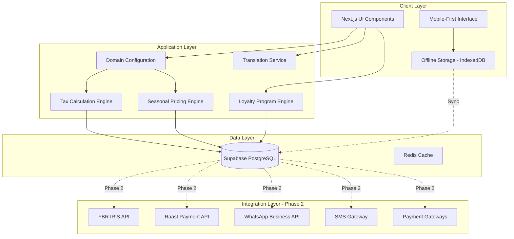

# Design Document: Pakistani Market 2026 Enhancements

## Overview

This design document outlines the technical architecture and implementation strategy for enhancing TENVO's Pakistani market capabilities to meet 2026 regulatory requirements and market expectations. The system currently has foundational Pakistani support limited to the retail-shop domain, including basic payment gateways (JazzCash, Easypaisa, PayFast), tax structures (NTN, SRN, provincial tax), and partial Urdu translations. This enhancement expands these capabilities across 10 additional business domains while adding critical 2026 requirements.

### Implementation Phases

The implementation is divided into two phases based on external API dependencies:

**Phase 1 (MVP - No External APIs):**
- Domain expansion (pharmacy, grocery, textile, fmcg, ecommerce, garments, mobile, electronics-goods, bakery-confectionery, boutique-fashion)
- Comprehensive Urdu translations for all UI elements
- Pakistani brand databases for each domain
- Market location databases for major cities
- Enhanced seasonal pricing data structures
- Pakistani-specific field configurations
- Payment terms consolidation and standardization
- Tax category standardization
- Domain knowledge organization improvements
- UI/UX improvements for Pakistani users
- Offline-capable data structures
- Multi-currency data models
- Loyalty program foundation
- Inventory forecasting data structures

**Phase 2 (Post-MVP - External API Integrations):**
- FBR IRIS integration for e-invoicing
- Raast payment system integration
- WhatsApp Business API integration
- SMS gateway integration
- Payment gateway webhook enhancements
- Digital signature implementation
- QR code verification endpoints
- AI-powered tax calculation with FBR rule engine

### Design Principles

1. **Backward Compatibility**: All enhancements must maintain compatibility with existing retail-shop implementations
2. **Domain Modularity**: Pakistani features are configured per domain, allowing selective enablement
3. **Progressive Enhancement**: Phase 1 provides immediate value without external dependencies; Phase 2 adds advanced integrations
4. **Localization First**: Urdu support is comprehensive, not an afterthought
5. **Mobile Optimization**: All interfaces prioritize mobile experience (75% of Pakistani users)
6. **Offline Resilience**: Critical operations work offline with automatic sync
7. **Compliance by Design**: FBR requirements are built into core data structures

## Architecture

### System Context

TENVO is a multi-tenant Next.js application with Supabase backend. The Pakistani market enhancements integrate into the existing architecture through:

1. **Domain Configuration Layer**: Extends `lib/domainKnowledge.js` to include Pakistani features per domain
2. **Localization Layer**: Extends `lib/translations.js` with comprehensive Urdu translations
3. **Data Layer**: Extends database schema with Pakistani-specific fields (NTN, SRN, IRIS tokens, Raast IDs)
4. **Integration Layer**: New service modules for external APIs (Phase 2)
5. **UI Layer**: Enhanced components with RTL support and mobile-first design

### High-Level Architecture Diagram



### Technology Stack

- **Frontend**: Next.js 14, React 18, Tailwind CSS
- **Backend**: Supabase (PostgreSQL, Auth, Storage, Realtime)
- **State Management**: React Context + Local Storage (offline)
- **Localization**: Custom translation service with RTL support
- **Mobile**: Responsive design + PWA capabilities
- **Offline**: IndexedDB via Dexie.js
- **Phase 2 Integrations**: REST APIs with webhook support

## Components and Interfaces

### 1. Domain Configuration Module

**Purpose**: Centralized configuration for Pakistani features per business domain

**Location**: `lib/domainData/pakistaniDomainConfig.js`

**Interface**:
```javascript
interface PakistaniDomainConfig {
  paymentGateways: string[];           // ['jazzcash', 'easypaisa', 'raast', 'payfast', 'cod']
  taxCompliance: string[];             // ['fbr', 'ntn', 'srn', 'provincial_tax', 'wht']
  languages: string[];                 // ['en', 'ur']
  seasonalPricing: boolean;            // Enable seasonal pricing engine
  localBrands: boolean;                // Enable Pakistani brand database
  urduCategories: boolean;             // Enable Urdu category translations
  marketLocations: string[];           // City-specific market locations
  popularBrands: string[];             // Domain-specific Pakistani brands
  taxCategories: string[];             // FBR-compliant tax categories
  paymentTerms: string[];              // Pakistani payment terms
  fieldConfig: object;                 // Domain-specific field configurations
}
```

**Domains to Configure**:
- retail-shop (existing, enhance)
- pharmacy
- grocery
- textile-wholesale
- fmcg
- ecommerce
- garments
- mobile
- electronics-goods
- bakery-confectionery
- boutique-fashion

### 2. Translation Service

**Purpose**: Comprehensive Urdu translations with RTL layout support

**Location**: `lib/translations.js` (extend existing)

**Interface**:
```javascript
interface TranslationService {
  t(key: string, lang: string): string;
  getDirection(lang: string): 'ltr' | 'rtl';
  formatNumber(num: number, lang: string): string;  // English vs Urdu numerals
  formatDate(date: Date, lang: string): string;     // English vs Urdu date format
  formatCurrency(amount: number, lang: string): string;
}
```

**Translation Coverage**:
- All UI elements (menus, buttons, labels, placeholders)
- Error messages and validation messages
- Domain-specific terminology (pharmacy, textile, etc.)
- Pakistani brands and categories
- Tax and compliance terms
- Payment method names
- Report headers and labels
- Help text and tooltips

### 3. Pakistani Brand Database

**Purpose**: Comprehensive brand lists for quick product entry

**Location**: `lib/domainData/pakistaniBrands.js`

**Structure**:
```javascript
interface BrandDatabase {
  clothing: string[];
  footwear: string[];
  electronics: string[];
  food: string[];
  personalCare: string[];
  pharmaceutical: string[];
  textile: string[];
  mobile: string[];
  bakery: string[];
  // ... per domain
}
```

**Data Sources**:
- Existing `pakistaniRetailData.js` (clothing, footwear, electronics, food, personalCare)
- New pharmaceutical brands (Getz Pharma, Searle, Abbott, GSK, Novartis Pakistan, Pfizer Pakistan, Sanofi Pakistan)
- New textile mills (Gul Ahmed, Nishat Mills, Sapphire, Al-Karam, Crescent, Masood Textile, Kohinoor Mills)
- New mobile brands (Samsung, Apple, Xiaomi, Oppo, Vivo, Realme, Infinix, Tecno, QMobile)
- New bakery brands (Bundu Khan, Jalal Sons, Rahat Bakers, Delizia, Bread & Beyond)

### 4. Market Location Database

**Purpose**: Pakistani market and bazaar locations for customer/supplier tagging

**Location**: `lib/domainData/pakistaniMarkets.js`

**Structure**:
```javascript
interface MarketDatabase {
  lahore: Array<{en: string, ur: string}>;
  karachi: Array<{en: string, ur: string}>;
  islamabad: Array<{en: string, ur: string}>;
  faisalabad: Array<{en: string, ur: string}>;
  rawalpindi: Array<{en: string, ur: string}>;
  multan: Array<{en: string, ur: string}>;
  peshawar: Array<{en: string, ur: string}>;
  quetta: Array<{en: string, ur: string}>;
}
```

**Example Data**:
```javascript
lahore: [
  {en: 'Anarkali Bazaar', ur: 'انارکلی بازار'},
  {en: 'Liberty Market', ur: 'لبرٹی مارکیٹ'},
  {en: 'Fortress Stadium', ur: 'فورٹریس اسٹیڈیم'},
  {en: 'Hall Road', ur: 'ہال روڈ'},
  {en: 'Ichhra Bazaar', ur: 'اچھرا بازار'},
  {en: 'Azam Cloth Market', ur: 'اعظم کپڑا مارکیٹ'}
]
```

### 5. Seasonal Pricing Engine

**Purpose**: Automated price adjustments for Pakistani seasons

**Location**: `lib/services/seasonalPricing.js`

**Interface**:
```javascript
interface SeasonalPricingEngine {
  getCurrentSeason(): Season | null;
  getSeasonalDiscount(productId: string, categoryId: string): number;
  applySeasonalPricing(price: number, discount: number): {original: number, discounted: number};
  getUpcomingSeason(daysAhead: number): Season | null;
  calculateIslamicDate(gregorianDate: Date): HijriDate;
}

interface Season {
  key: string;                    // 'ramadan', 'eid_ul_fitr', etc.
  name: {en: string, ur: string};
  startDate: Date;
  endDate: Date;
  discountPercent: number;
  applicableCategories: string[];
}
```

**Seasonal Periods**:
- Ramadan (10% discount, Islamic calendar based)
- Eid ul-Fitr (15% discount)
- Eid ul-Adha (15% discount)
- Independence Day (5% discount, August 14)
- Winter Sale (20% discount, Nov-Jan)
- Summer Sale (15% discount, May-Jul)

### 6. Tax Calculation Engine (Phase 1: Rule-Based)

**Purpose**: Intelligent tax calculation following FBR rules

**Location**: `lib/services/taxCalculation.js`

**Interface**:
```javascript
interface TaxCalculationEngine {
  calculateTax(params: TaxCalculationParams): TaxResult;
  getTaxCategory(productType: string, domain: string): string;
  validateNTN(ntn: string): boolean;
  getProvincialTaxRate(province: string): number;
  getWHTRate(transactionType: string, hasNTN: boolean): number;
}

interface TaxCalculationParams {
  amount: number;
  productType: string;
  domain: string;
  customerNTN?: string;
  province: string;
  isExempt: boolean;
}

interface TaxResult {
  federalSalesTax: number;        // 17% or 18%
  provincialTax: number;          // Punjab 16%, Sindh 13%, KP 15%, Balochistan 15%
  withholdingTax: number;         // WHT if applicable
  totalTax: number;
  taxBreakdown: object;
  applicableRules: string[];
}
```

**Tax Categories**:
- Sales Tax 17%
- Sales Tax 18%
- Provincial Tax (province-specific)
- WHT 2% (withholding tax)
- Zero Rated
- Exempt
- Further Tax 3%

### 7. Loyalty Program Engine

**Purpose**: Customer loyalty points and rewards

**Location**: `lib/services/loyaltyProgram.js`

**Interface**:
```javascript
interface LoyaltyProgramEngine {
  awardPoints(customerId: string, amount: number, categoryId: string): number;
  redeemPoints(customerId: string, points: number): {success: boolean, discount: number};
  getPointBalance(customerId: string): number;
  getCustomerTier(customerId: string): 'Silver' | 'Gold' | 'Platinum';
  calculatePointsExpiry(customerId: string): Array<{points: number, expiryDate: Date}>;
  sendExpiryReminder(customerId: string, daysBeforeExpiry: number): void;
}
```

**Configuration**:
- Base rate: 1 point per 100 PKR spent
- Redemption: 100 points = 100 PKR discount
- Expiry: 12 months from earning date
- Tiers: Silver (0-10k points), Gold (10k-50k), Platinum (50k+)
- Tier multipliers: Silver 1x, Gold 1.5x, Platinum 2x

### 8. Inventory Forecasting Engine

**Purpose**: Seasonal demand prediction for Pakistani markets

**Location**: `lib/services/inventoryForecasting.js`

**Interface**:
```javascript
interface InventoryForecastingEngine {
  forecastSeasonalDemand(productId: string, season: string): ForecastResult;
  getSuggestedReorderQuantity(productId: string, daysUntilSeason: number): number;
  analyzeHistoricalSeasonalSales(productId: string, season: string, yearsBack: number): SalesPattern;
  getForecastAccuracy(productId: string, season: string): number;
  generateSeasonalStockAlert(daysBeforeSeason: number): Array<StockAlert>;
}

interface ForecastResult {
  productId: string;
  season: string;
  predictedDemand: number;
  confidence: number;
  suggestedReorderQty: number;
  suggestedReorderDate: Date;
  historicalAverage: number;
  yearOverYearGrowth: number;
}
```

### 9. Offline Sync Manager

**Purpose**: Enable offline invoice creation with automatic sync

**Location**: `lib/services/offlineSync.js`

**Interface**:
```javascript
interface OfflineSyncManager {
  isOnline(): boolean;
  saveOfflineInvoice(invoice: Invoice): string;  // Returns local ID
  getOfflineInvoices(): Invoice[];
  syncToServer(): Promise<SyncResult>;
  detectConflicts(localInvoice: Invoice, serverInvoice: Invoice): Conflict | null;
  resolveConflict(conflict: Conflict, resolution: 'local' | 'server'): void;
  getLastSyncTimestamp(): Date;
  getPendingSyncCount(): number;
}
```

**Storage**: IndexedDB via Dexie.js
- Invoices table
- Products table (cached)
- Customers table (cached)
- Sync queue table

### 10. Multi-Currency Manager

**Purpose**: Foreign currency support for importers

**Location**: `lib/services/multiCurrency.js`

**Interface**:
```javascript
interface MultiCurrencyManager {
  getExchangeRate(currency: string, date: Date): Promise<number>;
  convertToPKR(amount: number, currency: string, date: Date): Promise<number>;
  calculateExchangeGainLoss(purchaseOrderId: string): number;
  getSupportedCurrencies(): string[];  // ['USD', 'EUR', 'GBP', 'AED', 'CNY']
  getExchangeRateSource(): string;     // 'State Bank of Pakistan'
  storeExchangeRate(currency: string, rate: number, date: Date): void;
}
```

### 11. Phase 2 Integration Services

These services will be implemented in Phase 2:

**FBR IRIS Service** (`lib/services/fbrIris.js`):
- Submit invoice to IRIS
- Generate IRIS verification token
- Create FBR-compliant QR code
- Apply digital signature
- Handle submission retries
- Verify invoice status

**Raast Payment Service** (`lib/services/raastPayment.js`):
- Generate Raast QR code
- Process payment webhooks
- Handle payment confirmations
- Process refunds
- Reconcile transactions

**WhatsApp Business Service** (`lib/services/whatsappBusiness.js`):
- Send order confirmations
- Send payment reminders
- Track message delivery status
- Handle customer replies
- Manage opt-in/opt-out preferences

**SMS Gateway Service** (`lib/services/smsGateway.js`):
- Send SMS notifications (fallback)
- Track delivery status
- Calculate SMS costs
- Rate limiting

**Digital Signature Service** (`lib/services/digitalSignature.js`):
- Upload NTN certificate
- Sign invoice PDFs
- Verify signatures
- Check certificate validity
- Handle certificate expiry

## Data Models

### 1. Extended Business Profile

```sql
-- Add Pakistani-specific fields to businesses table
ALTER TABLE businesses ADD COLUMN IF NOT EXISTS ntn VARCHAR(20);
ALTER TABLE businesses ADD COLUMN IF NOT EXISTS srn VARCHAR(20);
ALTER TABLE businesses ADD COLUMN IF NOT EXISTS province VARCHAR(50);
ALTER TABLE businesses ADD COLUMN IF NOT EXISTS market_location VARCHAR(100);
ALTER TABLE businesses ADD COLUMN IF NOT EXISTS preferred_language VARCHAR(5) DEFAULT 'en';
ALTER TABLE businesses ADD COLUMN IF NOT EXISTS enable_seasonal_pricing BOOLEAN DEFAULT false;
ALTER TABLE businesses ADD COLUMN IF NOT EXISTS enable_loyalty_program BOOLEAN DEFAULT false;
ALTER TABLE businesses ADD COLUMN IF NOT EXISTS digital_certificate_path VARCHAR(255);
ALTER TABLE businesses ADD COLUMN IF NOT EXISTS certificate_expiry_date DATE;
```

### 2. Extended Invoice Model

```sql
-- Add Pakistani compliance fields to invoices table
ALTER TABLE invoices ADD COLUMN IF NOT EXISTS iris_token VARCHAR(255);
ALTER TABLE invoices ADD COLUMN IF NOT EXISTS iris_submission_timestamp TIMESTAMP;
ALTER TABLE invoices ADD COLUMN IF NOT EXISTS iris_status VARCHAR(50);
ALTER TABLE invoices ADD COLUMN IF NOT EXISTS fbr_qr_code TEXT;
ALTER TABLE invoices ADD COLUMN IF NOT EXISTS raast_qr_code TEXT;
ALTER TABLE invoices ADD COLUMN IF NOT EXISTS raast_transaction_id VARCHAR(100);
ALTER TABLE invoices ADD COLUMN IF NOT EXISTS digital_signature TEXT;
ALTER TABLE invoices ADD COLUMN IF NOT EXISTS seasonal_discount_applied NUMERIC(10,2) DEFAULT 0;
ALTER TABLE invoices ADD COLUMN IF NOT EXISTS season_key VARCHAR(50);
ALTER TABLE invoices ADD COLUMN IF NOT EXISTS loyalty_points_awarded INTEGER DEFAULT 0;
ALTER TABLE invoices ADD COLUMN IF NOT EXISTS loyalty_points_redeemed INTEGER DEFAULT 0;
```

### 3. Extended Customer Model

```sql
-- Add Pakistani-specific customer fields
ALTER TABLE customers ADD COLUMN IF NOT EXISTS ntn VARCHAR(20);
ALTER TABLE customers ADD COLUMN IF NOT EXISTS market_location VARCHAR(100);
ALTER TABLE customers ADD COLUMN IF NOT EXISTS preferred_language VARCHAR(5) DEFAULT 'en';
ALTER TABLE customers ADD COLUMN IF NOT EXISTS whatsapp_number VARCHAR(20);
ALTER TABLE customers ADD COLUMN IF NOT EXISTS whatsapp_opt_in BOOLEAN DEFAULT true;
ALTER TABLE customers ADD COLUMN IF NOT EXISTS sms_opt_in BOOLEAN DEFAULT true;
ALTER TABLE customers ADD COLUMN IF NOT EXISTS loyalty_points INTEGER DEFAULT 0;
ALTER TABLE customers ADD COLUMN IF NOT EXISTS loyalty_tier VARCHAR(20) DEFAULT 'Silver';
ALTER TABLE customers ADD COLUMN IF NOT EXISTS preferred_payment_method VARCHAR(50);
```

### 4. Loyalty Points Transaction Table

```sql
CREATE TABLE IF NOT EXISTS loyalty_transactions (
  id UUID PRIMARY KEY DEFAULT uuid_generate_v4(),
  customer_id UUID REFERENCES customers(id) ON DELETE CASCADE,
  business_id UUID REFERENCES businesses(id) ON DELETE CASCADE,
  invoice_id UUID REFERENCES invoices(id) ON DELETE SET NULL,
  transaction_type VARCHAR(20) NOT NULL, -- 'earned', 'redeemed', 'expired'
  points INTEGER NOT NULL,
  balance_after INTEGER NOT NULL,
  description TEXT,
  expiry_date DATE,
  created_at TIMESTAMP DEFAULT NOW(),
  created_by UUID REFERENCES auth.users(id)
);

CREATE INDEX idx_loyalty_customer ON loyalty_transactions(customer_id);
CREATE INDEX idx_loyalty_business ON loyalty_transactions(business_id);
CREATE INDEX idx_loyalty_expiry ON loyalty_transactions(expiry_date) WHERE transaction_type = 'earned';
```

### 5. Seasonal Pricing Configuration Table

```sql
CREATE TABLE IF NOT EXISTS seasonal_pricing_config (
  id UUID PRIMARY KEY DEFAULT uuid_generate_v4(),
  business_id UUID REFERENCES businesses(id) ON DELETE CASCADE,
  season_key VARCHAR(50) NOT NULL,
  season_name_en VARCHAR(100) NOT NULL,
  season_name_ur VARCHAR(100),
  start_date DATE NOT NULL,
  end_date DATE NOT NULL,
  discount_percent NUMERIC(5,2) NOT NULL,
  applicable_categories TEXT[], -- Array of category IDs
  is_active BOOLEAN DEFAULT true,
  created_at TIMESTAMP DEFAULT NOW(),
  updated_at TIMESTAMP DEFAULT NOW()
);

CREATE INDEX idx_seasonal_business ON seasonal_pricing_config(business_id);
CREATE INDEX idx_seasonal_dates ON seasonal_pricing_config(start_date, end_date);
```

### 6. Exchange Rate History Table

```sql
CREATE TABLE IF NOT EXISTS exchange_rates (
  id UUID PRIMARY KEY DEFAULT uuid_generate_v4(),
  currency_code VARCHAR(3) NOT NULL,
  rate_to_pkr NUMERIC(12,4) NOT NULL,
  rate_date DATE NOT NULL,
  source VARCHAR(100) DEFAULT 'State Bank of Pakistan',
  created_at TIMESTAMP DEFAULT NOW(),
  UNIQUE(currency_code, rate_date)
);

CREATE INDEX idx_exchange_currency_date ON exchange_rates(currency_code, rate_date DESC);
```

### 7. Purchase Order Extended Model

```sql
-- Add multi-currency support to purchase orders
ALTER TABLE purchase_orders ADD COLUMN IF NOT EXISTS currency_code VARCHAR(3) DEFAULT 'PKR';
ALTER TABLE purchase_orders ADD COLUMN IF NOT EXISTS foreign_currency_amount NUMERIC(15,2);
ALTER TABLE purchase_orders ADD COLUMN IF NOT EXISTS exchange_rate NUMERIC(12,4);
ALTER TABLE purchase_orders ADD COLUMN IF NOT EXISTS pkr_amount NUMERIC(15,2);
ALTER TABLE purchase_orders ADD COLUMN IF NOT EXISTS exchange_gain_loss NUMERIC(15,2) DEFAULT 0;
```

### 8. Offline Sync Queue Table

```sql
CREATE TABLE IF NOT EXISTS offline_sync_queue (
  id UUID PRIMARY KEY DEFAULT uuid_generate_v4(),
  business_id UUID REFERENCES businesses(id) ON DELETE CASCADE,
  entity_type VARCHAR(50) NOT NULL, -- 'invoice', 'product', 'customer'
  entity_id UUID NOT NULL,
  entity_data JSONB NOT NULL,
  operation VARCHAR(20) NOT NULL, -- 'create', 'update', 'delete'
  created_offline_at TIMESTAMP NOT NULL,
  synced_at TIMESTAMP,
  sync_status VARCHAR(20) DEFAULT 'pending', -- 'pending', 'synced', 'conflict', 'failed'
  conflict_data JSONB,
  error_message TEXT,
  retry_count INTEGER DEFAULT 0,
  created_at TIMESTAMP DEFAULT NOW()
);

CREATE INDEX idx_offline_sync_business ON offline_sync_queue(business_id);
CREATE INDEX idx_offline_sync_status ON offline_sync_queue(sync_status) WHERE sync_status = 'pending';
```

### 9. Phase 2: IRIS Submission Log Table

```sql
CREATE TABLE IF NOT EXISTS iris_submission_log (
  id UUID PRIMARY KEY DEFAULT uuid_generate_v4(),
  invoice_id UUID REFERENCES invoices(id) ON DELETE CASCADE,
  business_id UUID REFERENCES businesses(id) ON DELETE CASCADE,
  submission_timestamp TIMESTAMP NOT NULL,
  iris_token VARCHAR(255),
  response_status VARCHAR(50) NOT NULL,
  response_code VARCHAR(20),
  response_message TEXT,
  retry_count INTEGER DEFAULT 0,
  created_at TIMESTAMP DEFAULT NOW()
);

CREATE INDEX idx_iris_invoice ON iris_submission_log(invoice_id);
CREATE INDEX idx_iris_business ON iris_submission_log(business_id);
```

### 10. Phase 2: Payment Gateway Transaction Table

```sql
CREATE TABLE IF NOT EXISTS payment_transactions (
  id UUID PRIMARY KEY DEFAULT uuid_generate_v4(),
  invoice_id UUID REFERENCES invoices(id) ON DELETE CASCADE,
  business_id UUID REFERENCES businesses(id) ON DELETE CASCADE,
  gateway VARCHAR(50) NOT NULL, -- 'jazzcash', 'easypaisa', 'raast', 'payfast'
  transaction_id VARCHAR(255) NOT NULL,
  amount NUMERIC(15,2) NOT NULL,
  gateway_fee NUMERIC(15,2) NOT NULL,
  net_amount NUMERIC(15,2) NOT NULL,
  status VARCHAR(50) NOT NULL, -- 'pending', 'completed', 'failed', 'refunded'
  payment_method VARCHAR(50), -- 'wallet', 'card', 'bank_transfer'
  customer_phone VARCHAR(20),
  webhook_data JSONB,
  created_at TIMESTAMP DEFAULT NOW(),
  completed_at TIMESTAMP
);

CREATE INDEX idx_payment_invoice ON payment_transactions(invoice_id);
CREATE INDEX idx_payment_gateway ON payment_transactions(gateway, status);
CREATE INDEX idx_payment_transaction_id ON payment_transactions(transaction_id);
```

### 11. Phase 2: Notification Log Table

```sql
CREATE TABLE IF NOT EXISTS notification_log (
  id UUID PRIMARY KEY DEFAULT uuid_generate_v4(),
  business_id UUID REFERENCES businesses(id) ON DELETE CASCADE,
  customer_id UUID REFERENCES customers(id) ON DELETE CASCADE,
  invoice_id UUID REFERENCES invoices(id) ON DELETE SET NULL,
  channel VARCHAR(20) NOT NULL, -- 'whatsapp', 'sms'
  message_type VARCHAR(50) NOT NULL, -- 'order_confirmation', 'payment_reminder', 'loyalty_expiry'
  recipient VARCHAR(50) NOT NULL,
  message_content TEXT NOT NULL,
  status VARCHAR(20) NOT NULL, -- 'sent', 'delivered', 'read', 'failed'
  gateway_message_id VARCHAR(255),
  cost NUMERIC(10,4),
  error_message TEXT,
  created_at TIMESTAMP DEFAULT NOW(),
  delivered_at TIMESTAMP,
  read_at TIMESTAMP
);

CREATE INDEX idx_notification_customer ON notification_log(customer_id);
CREATE INDEX idx_notification_status ON notification_log(status, channel);
```

