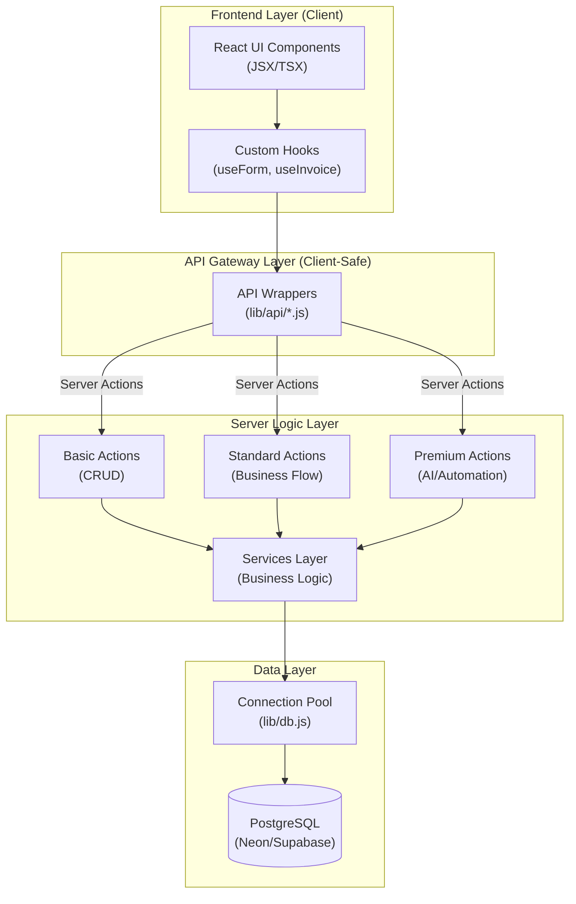

# Tenvo Backend & API Analysis Report

This report provides a deep dive into the features and capabilities of the Tenvo platform, including its core infrastructure and advanced AI-driven engines.

## 1. System Capabilities Overview

### 🏛️ Core Business & Accounting
*   **Unified Accounting**: Full General Ledger (GL) support with automatic and manual entry creation. Real-time generation of Trial Balances, Profit & Loss statements, and Balance Sheets.
*   **Sales Lifecycle**: Comprehensive flow from Quotation → Sales Order → Delivery Challan → Invoice.
*   **Multi-Business Support**: Designed to handle multiple businesses under a single user context with strict data isolation.

### 📦 Advanced Inventory & Supply Chain
*   **Multi-Dimension Tracking**: Support for Variant Matrices (Size/Color) ideal for retail and garment industries.
*   **Unit & Batch Traceability**: Serial number tracking (electronics) and Batch management with expiry tracking (pharma/FMCG).
*   **Dynamic Warehousing**: Multi-location stock management with transfer capabilities and stock level alerts.

### 🏭 Manufacturing (Premium)
*   **BOM Management**: Multi-level Bill of Materials for complex product assembly.
*   **Production Lifecycle**: Creation and status tracking of Production Orders linked to inventory availability.

### 🧠 2026 AI Revenue Engine
*   **Marketing Agent**: Behavioral customer segmentation (VIP, Churn-risk, New Leads) with automated campaign message queuing.
*   **AI Promotions**: Dynamic discount engine supporting BOGO, order thresholds, and overstock-driven discount recommendations.
*   **Predictive Operations**: Demand forecasting for restock suggestions and natural language automation rules (Fuzzy Logic).

---

## 2. API & Integration Architecture

The platform follows a standardized, client-safe integration pattern:

### Key Integration Rules:
1.  **Frontend Components** NEVER import `lib/db.js` or bypass the API layer.
2.  **API Wrappers** provide a clean, predictable interface for the UI, handling data mapping and error normalization.
3.  **Server Actions** handle authentication (`checkAuth`) and RBAC before delegating to Services.
4.  **Services** contain pure business logic and handle database transactions.

---

## 3. Featured Endpoints & Wrappers

| Capability | Wrapper (`lib/api/`) | Primary Features |
| :--- | :--- | :--- |
| **Sales** | `invoiceAPI` | Robust total calculation, item metadata, status tracking. |
| **Inventory** | `productAPI`, `variantAPI` | Integrated upserts, Matrix creation, SKU management. |
| **Traceability** | `serialAPI`, `batchAPI` | Single-unit lookup, expiry checking, batch stock. |
| **Accounting** | `accountingAPI` | COA initialization, GL entries, financial reporting. |
| **AI Ops** | `manufacturingAPI` | Production status, BOM assembly. |
| **Automation**| `lib/actions/premium/ai` | Restock suggestions, Fuzzy Rule processing. |
