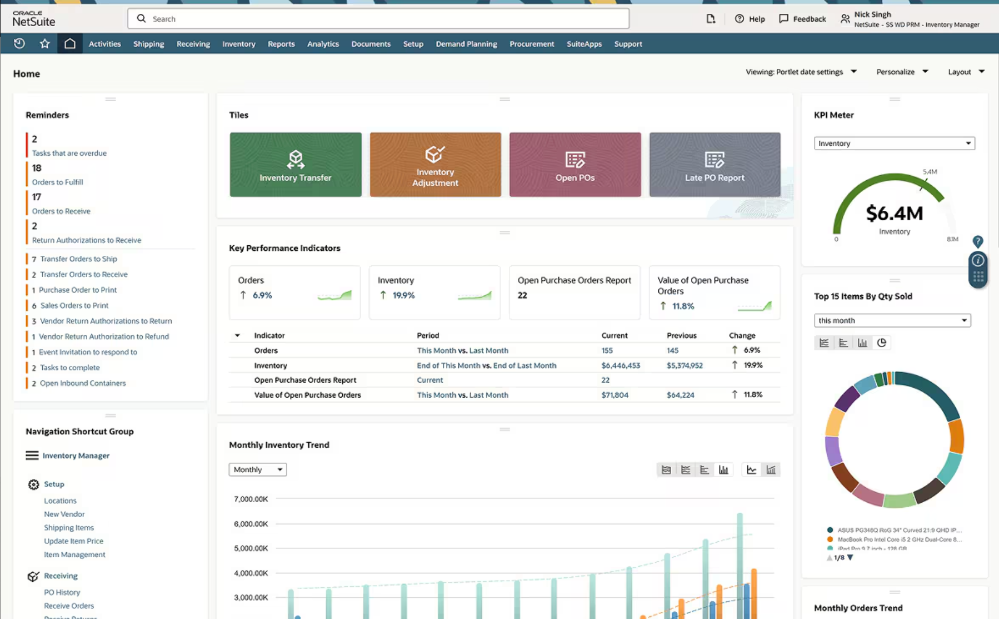

I tested 11 platforms and picked the 7 best inventory management software for 2025, focusing on integrations, forecasting, scalability, core controls, and real value for tech-savvy businesses.
Inventory software should keep multi-location stock accurate, automate reorders, flag exceptions, and plug cleanly into your POS/ecommerce, accounting, and 3PL tools. Use this guide to match the right tool to your use case, whether retail, multichannel, or manufacturing, with quick “best for” picks, verified pricing, and must-have features.

The best inventory management software for 2025 are:

NetSuite Inventory Management (Oracle): Best for complex, scaling operations
Zoho Inventory: Best overall for new and SMBs
Odoo Inventory: Best for highly customizable, modular ERP
Katana MRP: Best for modern SMB manufacturers
Cin7: Best for multichannel ecommerce + accounting sync
Unleashed Software: Best for wholesalers needing lot/serial traceability
Square for Retail: Best lugfor new/small retailers wanting fast POS + inventory

Best inventory management systems compared
This side-by-side compares the best inventory management software, showing ratings, starting price, and whether each offers webhooks, manufacturing/BOM, forecasting, and a free plan.

Product
Our rating (out of 5)
Free plan
Paid plans starting at
Native webhooks
Manufacturing / BOM
Predictive demand planning
NetSuite Inventory Management (Oracle)	
4.6
No
Custom quote
Custom
(via SuiteScript; no native webhooks)
Yes
(MRP & WMS modules)
Native
(Demand Planning module)
Zoho Inventory	
4.3
Yes
$29/mo (annual billing)
Yes
(workflows + webhooks)
Light
(composite items; not full MRP)
No
(basic reorder rules)
Odoo Inventory	
4.2
Yes
(One App Free)
From ~$35.40/user/mo (Standard, monthly)
Yes
(Automated Actions/Webhooks)
Yes
(MRP app)
No
(add 3rd-party/ Studio if needed)
Katana MRP	
4.1
Yes
From $359/mo (annual)
Yes
Yes
Add-on
(Planning & Forecasting)
Cin7	
4.0
No
From $349/mo
Yes
Yes
(AM/MRP modules)
Add-on (ForesightAI)
Unleashed Software	
3.9
No
From $410/mo
Yes
Yes
(Assemblies/BOM)
Add-on
(Advanced Inventory Manager)
Square for Retail (Plus)	
3.7
Yes
$49/mo per location (Free tier available)
Yes
No
No
NetSuite Inventory Management (Oracle): Best for complex, scaling operations
Our rating: 4.6 out of 5

Oracle Netsuite
Image: Oracle
NetSuite Inventory Management stands out for depth and extensibility: native demand planning that models seasonality and sales forecasts, enterprise-grade WMS with mobile RF barcode scanning, and a full developer platform (SuiteScript + SuiteTalk REST/SOAP) for custom logic and integrations. For multi-location, omnichannel operations, the NetSuite Connector keeps data flowing across ecommerce, marketplaces, POS, and 3PLs without brittle CSV hops.

Why I chose NetSuite
It earns “best overall” because it scales from sophisticated SMBs to mid-market and enterprise without swapping systems: advanced planning, configurable WMS, and a mature integration layer reduce manual work and data drift as order volume, channels, and locations grow.

Pricing
Model: Quote-based annual subscription for base edition + users + add-on modules (e.g., WMS, Demand Planning, Connector)
Typical first year (SMB): ~$25k–$50k all-in; complex rollouts cost more
Implementation: One-time services often $25k–$75k (migration, integrations, training)
Cost drivers: users, modules, locations/warehouses, order volume, integrations

Visit NetSuite
Features
Demand planning using historicals, seasonality, and sales forecasts
Mobile WMS with RF barcode scanning, putaway/pick strategies, cycle counts
SuiteScript (JavaScript) for custom workflows/UI; SuiteTalk REST/SOAP APIs
NetSuite Connector for ecommerce, marketplaces, POS, and 3PLs
Assemblies/BOMs and kits/packages for complex item structures
NetSuite inventory management dashboard
The NetSuite Inventory Management Dashboard. Source: NetSuite
Pros and cons
Pros
Cons
Deep planning + WMS in one platform; reduces point-solution sprawl
Powerful customization (SuiteScript) and standards-based APIs
Robust connector ecosystem for omnichannel data sync

Premium pricing and longer implementations than SMB-first tools
Advanced features often require additional modules and disciplined admin/dev ownership

https://www.netsuite.com/portal/products/erp/warehouse-fulfillment/inventory-management.shtml?acuuid=de01cdef-ff27-4f59-9858-46c5e973be8b