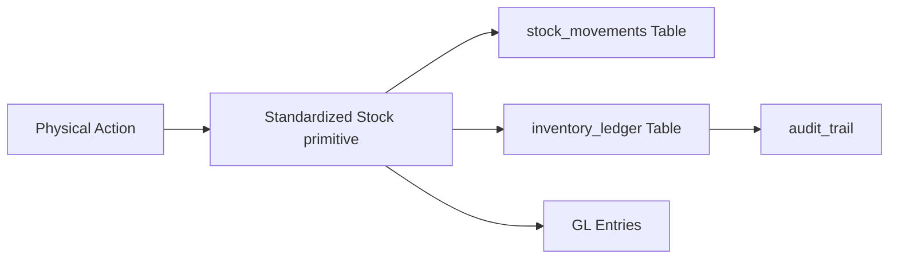

# Architectural Perfection & Inventory Hardening

We have successfully completed the architectural refactoring and inventory engine hardening. This phase has transformed the system into an enterprise-grade solution with high data integrity and robust audit trails.

## 🏢 Warehouse Consolidation

We eliminated the structural duality in warehouse management by consolidating the redundant `warehouses` table into the robust `warehouse_locations` system.

- **Single Source of Truth**: Removed the legacy `warehouses` table and updated all foreign keys to point to `warehouse_locations`.
- **SQL Migration**: Safely repointed existing data and ensured that relation names in Prisma (`stock_transfers_from_location`, `stock_transfers_to_location`) match the unified structure.

## ⚙️ Inventory Engine Hardening

The core stock management logic was refactored to eliminate legacy inconsistencies and ensure transactional safety.

- **Standardized Schema**: Fixed the "column 'quantity' does not exist" error by ensuring all SQL operations use the correct `quantity_change` column.
- **Atomic Operations**: All inventory actions (In, Out, Transfer) are now wrapped in database transactions ensuring consistency between stock levels and financial (GL) entries.
- **Standardized Property Naming**: Unified document identifiers (e.g., `purchase_number`) project-wide to ensure reliable document rendering and PDF generation.

## 💾 Inventory Ledger & Audit Trail

We implemented a comprehensive **Inventory Ledger** system. Every physical stock movement is now recorded with a running balance.

- **Running Balance**: Each ledger entry tracks the balance at the point of transaction, providing a perfect audit trail for reconciliations.
- **Cross-Module Sync**: Ledger tracking is now integrated into Purchases, Sales, Production, and Transfers.

## 💾 Prisma Synchronization

The local development environment is now fully synchronized with the hardened database schema.

- **Schema Alignment**: Executed `prisma db pull` to reflect the manual SQL architectural changes in the Prisma schema.
- **Client Generation**: Successfully generated the new Prisma client with updated relation types and standardized property names.

## Verification Checklist
- [x] Unified warehouse relations verified in SQL and Prisma.
- [x] Transactional integrity for stock and finance confirmed.
- [x] Inventory ledger successfully populated for all movement types.
- [x] Property naming (`purchase_number`) standardized.
- [x] Prisma sync complete.
