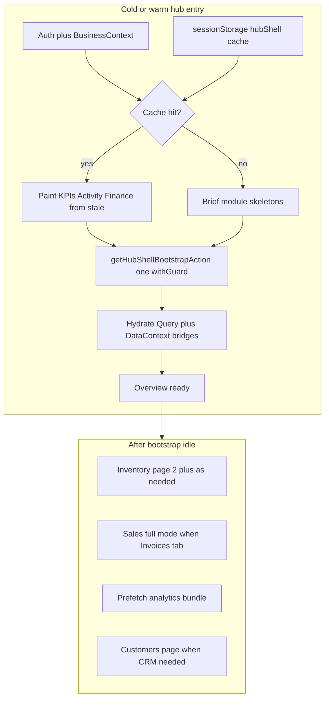

# Hub Enterprise Shell Bootstrap — Design Spec

**Date:** 2026-07-17  
**Status:** Implemented (Phase 1)  
**Scope:** Full Hub shell — Overview KPIs, Finance strip, Recent Activity, Visual Studio handoff, Inventory list bootstrap, Sales/invoices bootstrap  
**Non-scope (Phase 2+):** POS full catalog rewrite, public storefront homepage, marketing pages, full Zustand DataContext replacement

## Problem

Cold hub refresh paints the shell early, then fans out ~7 `withGuard` Server Actions. Widgets unlock on different module flags. Recent Activity and Visual Studio each fire late independent fetches. Revenue KPI tiles wait on the invoice list even when server snapshot KPIs already exist. Inventory still loads an unbounded product catalog after lean bootstrap.

Result: Zoho/Busy-class apps feel “instant”; Tenvo shows staggered skeletons even though Postgres reads are live and correct.

## Goals

1. **Instant credible Overview** — KPI tiles, Finance Hero, Recent Activity show accurate numbers within one round-trip (or from stale cache instantly, then revalidate).
2. **One auth gate per cold paint** — single `withGuard` for the shell bootstrap payload.
3. **No correctness regressions** — invoice balances, inventory display stock, GL finance, product save paths, POS, storefront unchanged in behavior.
4. **Better than Zoho/Odoo/Busy perceived UX** — stale-while-revalidate, no blank KPI cards when cache exists, progressive enrichment without blocking tiles on list payloads.
5. **No further Phase-1 gaps** — activity, KPIs, finance strip, sales bootstrap, inventory first page, analytics prefetch contract all covered in this design.

## Success criteria

| Metric | Target |
|--------|--------|
| Cold Overview KPI tiles (no cache) | Leave skeleton only until **one** bootstrap action returns |
| Warm Overview (same business + date range within TTL) | Paint numbers from cache **before** network; soft-revalidate |
| Recent Activity vs Vertical intelligence | Activity data arrives with bootstrap — no longer loses race to sync playbook |
| Inventory tab first paint | First page of lean products + locations; not full unbounded catalog |
| Auth SQL on cold Overview | 1 membership/session path for bootstrap (not ~7) |
| Broken features | Zero: saves, POS sell, storefront checkout, finance reports still work |

## Approaches considered

### A — Expand DataContext only (more parallel actions)

Keep current orchestration; tune queries and flags.

- Pros: smallest diff  
- Cons: still N× `withGuard`; does not match enterprise cold-start model; gaps remain  

### B — Single Hub Shell Bootstrap action + SWR client layer (recommended)

One authenticated Server Action returns Overview + list seeds. Client shows stale cache instantly, revalidates, tab-lazy loads detail. Use existing `@tanstack/react-query` (already in package.json, unused).

- Pros: Zoho/Busy pattern; closes screenshot gaps; preserves Prisma/pg accuracy  
- Cons: careful migration of DataContext consumers  

### C — Full RSC streaming rewrite of `/business/*`

Move hub to server-streamed Suspense islands.

- Pros: modern Next.js  
- Cons: high break risk for client managers (Inventory, POS, Finance); out of Phase 1 scope  

**Decision:** **B**.

## Architecture

### Contract: `getHubShellBootstrapAction(businessId, { from, to })`

**One** `withGuard(businessId, { permission: 'sales.view' })`, then parallel internal work with `skipAuth: true` where helpers already support it:

| Slice | Source | Purpose |
|-------|--------|---------|
| `kpis` | Existing `getDashboardKPIs` | Revenue, orders, receivables, inventory aggregates, expenses |
| `finance` / `glSummary` | Existing snapshot merge with `getAccountingSummaryAction` | Finance Hero |
| `chartSeries` | Slim monthly financials (existing action logic, in-process) | Trends spark / strip |
| `activity` | `getUnifiedActivityFeedAction` SQL body (limit 25) | Recent Activity — no second POST |
| `invoices` | Cap 200, `includeItems: false`, balance enrich for page only | Sales seed + overdue UI |
| `productsPage` | Paginated lean list: `limit`+`offset`, `includeSerials: false`, include locations/variants/batches as today | Inventory first page |
| `locations` | Warehouse list | Inventory / stock UI |
| `expenseBreakdown` | Existing breakdown for range | Overview expense tiles |
| `meta` | `{ generatedAt, range, productTotalCount, invoiceTruncated }` | Pagination + cache keys |

**Explicitly excluded from bootstrap:** full customer `findMany`, purchases/vendors, manufacturing, payroll, approvals, analytics Visual Studio heavy bundle, product serials.

### Client: TanStack Query + DataContext bridge

`@tanstack/react-query` is already a dependency but unused. Phase 1 wires it for hub shell only — not a full app rewrite.

1. Add a hub-scoped `QueryClientProvider` under the business shell (or reuse root layout if one is added carefully without breaking storefront).
2. Query key: `['hubShell', businessId, from, to]`.
3. `staleTime`: 30–60s; `gcTime`: 5–10 min; persist last success to `sessionStorage` under the same key for instant warm paint (Zoho pattern).
4. Bridge into existing `DataContext` setters on success so InventoryManager / DomainDashboard keep working without rewriting every consumer in one PR:
   - `setDashboardMetrics(buildDashboardMetricsFromSnapshot(...))`
   - `setAdvancedDashboardSnapshot`
   - `setInvoices` (bootstrap depth)
   - `setProducts` from `productsPage` + set `moduleReady.inventoryCatalog` only when page-0 loaded **or** introduce `inventoryListReady` and teach Inventory UI to page (preferred — see Inventory below)
   - `setLocations`, `setExpenses` / breakdown, activity via feed props or small context field
5. Deprecate cold parallel `fetchFinance` + `fetchSales` + lean inventory + expenses + separate activity mount for Overview path once bootstrap is live.

### KPI unlock rules (closes Revenue skeleton gap)

| Tile | Unlock from |
|------|-------------|
| Orders / Revenue | Bootstrap `kpis` only — **do not** wait on `moduleReady.sales` |
| Overdue | Bootstrap `kpis.receivables` / finance overdue fields |
| Inventory Value / stock counts | Bootstrap `kpis.inventory` and/or GL inventory value |
| Finance Hero | Bootstrap `finance` |
| Period comparison sparklines | Prefer server series; client invoice re-sum is **fallback only** when bootstrap missing |

`periodMetrics` in `DomainDashboard` must prefer snapshot/bootstrap totals for current period revenue and orders; keep client reduce for previous-period estimate only if server does not provide it (or extend KPI SQL later — not blocking Phase 1 if previous period stays approximate).

### Recent Activity

- Remove independent cold `useEffect` fetch from `RecentActivityFeed` when parent passes `initialActivities` / query data from bootstrap.
- Keep a manual refresh control that calls a lightweight activity-only action; no polling interval in Phase 1.
- Default `loading=false` when initial data provided.

### Visual Studio / Performance Analytics

- Keep IntersectionObserver deferral so it does not compete with bootstrap.
- After bootstrap success + `requestIdleCallback` (or 1s timeout), **prefetch** `getAnalyticsBundleAction` into React Query key `['hubAnalytics', businessId, range]`.
- Visual Studio reads that cache — first open often instant; otherwise short skeleton only.

### Inventory (Phase 1 complete, no open pagination gap)

Current gap: unbounded `productAPI.getAll` after `isDataLoaded`.

**New contract:**

1. Bootstrap returns page 0 (`limit` default **100**, configurable, max 200) + `productTotalCount`.
2. Inventory tab / Excel / Visual grid: load additional pages via `getProductsAction({ limit, offset, includeSerials: false })` with infinite scroll or “Load more” — grid must not require all SKUs for first paint.
3. POS: **unchanged path** for Phase 1 (may still request its own catalog). Document as Phase 2 if POS remains heavy — do not break POS by forcing pagination without POS testing.
4. Search / barcode / scan: server lookup already exists (`lookupProductByScanCodeAction`) — prefer that over requiring full catalog in memory.
5. After product save: keep existing merge/`notify.compactSave` patterns from inventory UX spec — patch local page cache; do not re-bootstrap entire shell unless force.

### Sales / customers

- Bootstrap invoices (200, no items) satisfy Overview and first Invoices tab paint.
- Unbounded `customerAPI.getAll` **removed from cold path**. CRM / customer pickers load customers on tab open or typeahead (existing or slim paginated action).
- Overdue KPI uses bootstrap aggregates, not full customer scan.

### Auth / pool

- Bootstrap: one `withGuard`. Nested helpers use `skipAuth: true` (already used in advanced snapshot).
- Prefer one `pool.connect()` only where a helper already holds a client; otherwise parallel Promise.all of existing helpers is fine **inside** the single action (one auth, parallel SQL).
- Do not hold one client across all sequential analytics-style queries inside bootstrap — keep bootstrap slices parallel.

### Cache invalidation

Invalidate or mark stale `['hubShell', businessId, …]` after:

- Invoice create/payment  
- Product upsert/delete/stock transfer  
- Expense create  
- Explicit date-range change (new key)  
- Manual refresh  

Use existing mutation success paths to `queryClient.invalidateQueries` — soft, not full page reload.

### Error handling

- Bootstrap partial failure: return successful slices + `errors: { invoices?: string, … }`; UI shows tiles that succeeded; failed bands get retry.
- Hard auth failure: existing redirect / toast behavior.
- Never leave infinite skeleton: 12s timeout → error state + Retry on Overview bands.

## File map (implementation guidance)

| Area | Primary files |
|------|----------------|
| Bootstrap action | New `lib/actions/dashboard/hubShellBootstrap.js` |
| Metrics mapping | Extend `lib/dashboard/hubBootstrapMetrics.js` |
| DataContext | `lib/context/DataContext.js` — prefer bootstrap; stop N parallel cold fetches |
| Query provider | New thin `lib/context/HubQueryProvider.jsx` + wire in business layout/shell |
| Overview flags | `app/business/[category]/DashboardClient.jsx`, `DomainDashboard.tsx`, Easy dashboard |
| Activity | `RecentActivityFeed.client.tsx` |
| Analytics prefetch | `VisualAnalyticsPanel.client.tsx`, `AnalyticsDashboard.client.tsx` |
| Products pagination | `ProductService.getProducts`, inventory list callers |
| Verify | Extend or add `scripts/verify-hub-shell-bootstrap.mjs`; run `verify:easy-dashboard`, `verify:hub-tabs-forms` |

## Integrity / must not break

- `upsertIntegratedProductAction` / `handleSaveProduct` / serial deferred contract  
- `ProductService.resolveDisplayStock` semantics on returned rows  
- Invoice `calculate_invoice_balance` for returned page  
- Finance GL reports and `verify:finance-gl` paths  
- POS variants and barcode scan  
- Storefront checkout / tenancy  
- Desktop layouts / `lg:` dual layout  

## Phasing inside Phase 1 (still one shippable design)

1. **Bootstrap action + KPI unlock from kpis** (biggest screenshot win)  
2. **Activity in bootstrap + feed props**  
3. **DataContext cold path → single bootstrap + React Query cache**  
4. **Inventory page-0 + pagination API for Inventory tab**  
5. **Analytics idle prefetch**  
6. **Remove unbounded customers from sales bootstrap**  
7. **Verification scripts + smoke checklist**  

## Out of scope (explicit Phase 2)

- POS catalog pagination / virtualization  
- Storefront homepage rail architecture  
- Replacing entire DataContext with Zustand  
- Persisted Postgres materialized KPI tables / Redis KPI cache (nice later; session SWR is enough for Phase 1)  
- LOWER(domain) index / storefront search tsvector  

## Verification checklist

- [ ] Cold Overview: Network shows **one** hub shell bootstrap POST for KPI/activity/finance seed (plus auth already settled)  
- [ ] Warm Overview: numbers visible before bootstrap completes  
- [ ] Recent Activity not skeleton while Vertical intelligence is visible (unless both empty tenant)  
- [ ] Revenue tile not gated on `moduleReady.sales`  
- [ ] Inventory tab usable with page 0; total count shown; load more works  
- [ ] Product save still patches grid; no full-shell refresh storm  
- [ ] POS sell + barcode still works  
- [ ] Invoice record payment still updates balance  
- [ ] `bun run verify:easy-dashboard`  
- [ ] `bun run verify:hub-tabs-forms`  
- [ ] New `verify:hub-shell-bootstrap` asserts payload shape + pagination defaults  

## Open decisions locked by this spec

| Topic | Lock |
|-------|------|
| Phase 1 scope | Full Hub shell (Option B) |
| Approach | Single bootstrap + TanStack Query SWR |
| Inventory | Paginated page-0 in bootstrap; not full catalog on cold path |
| POS | Unchanged in Phase 1 |
| Customers on cold path | Not loaded unbounded |
| Activity | Inside bootstrap |
| Visual Studio | Idle prefetch after bootstrap |
