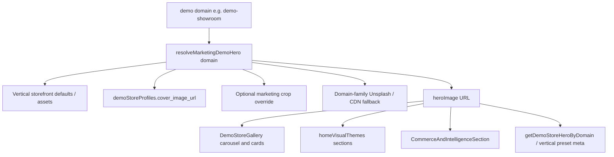

# Marketing Demo Hero Domain Awareness — Design Spec

**Date:** 2026-07-18  
**Status:** Implemented  
**Scope:** Homepage marketing sections that show demo storefront imagery, plus shared helpers consumed by `/solutions/*`, `/features`, `/why-tenvo`, and `/demo`  
**Non-scope:** Changing live public storefront hero UX, re-seeding demo catalogs, redesigning marketing layout/copy beyond image assignment, case-study placeholder images

## Problem

Marketing homepage and related pages advertise live demo storefronts (honest stat: **17** featured; hero carousel ~**16** after exclusions), but card/hero images often do not match the vertical the visitor will see when they open `/store/demo-*`.

Root causes:

1. **Parallel image tables** — `GALLERY_OVERRIDES` in `lib/marketing/demoStoreGalleryMeta.js` hardcodes Unsplash/CDN URLs that drift from storefront defaults.
2. **Cross-vertical leaks** — `demo-showroom` uses an auto-parts archive slide; solutions `vehicle-dealership` preset also points at `AUTO_PARTS_DEFAULT_SLIDES[0]`.
3. **Duplicate URLs across distinct demos** — `demo-supermarket` and `demo-fmcg` share the same supermarket slide; bakery/confectionery profiles historically shared the same Unsplash cover.
4. **Non-domain fallbacks** — missing overrides fall back to a fashion Unsplash id; `DemoStoreGallery` image-error fallback is a car photo for every vertical.
5. **Homepage section reuse** — `homeVisualThemes.js` and `CommerceAndIntelligenceSection` re-link the same few demos (boutique / supermarket / pharmacy) across spotlight, toolkit, industry, and commerce pillars, so the page feels repetitive even when each URL is “correct.”

## Goals

1. **Accurate representation** — Each featured demo’s marketing hero is the same family of asset the public store uses (primary hero slide / cover / elevated default).
2. **One resolver** — Homepage, gallery, commerce pillars, and solutions package meta resolve heroes through one path (`getDemoStoreHeroByDomain` / shared map).
3. **No cross-vertical twins** — Distinct featured demos must not share an identical hero URL; dealership ≠ autoparts ≠ marketplace.
4. **Less visual repetition on the homepage** — Across major image sections, prefer distinct demo domains where the narrative still fits.
5. **Honest stats unchanged** — Keep **17** live demos / carousel exclusions as today unless a separate copy pass changes them.

## Success criteria

| Check | Target |
|-------|--------|
| Featured demos with unique `heroImage` URL | 100% of `FEATURED_DEMO_STORES` |
| `demo-showroom` hero | `TENVO_VEHICLES_ASSETS.hero.vehicles` (or equivalent dealership cover), never auto-parts archive |
| `vehicle-dealership` in `VERTICAL_PRESET_SLIDE_META` | Same dealership family, not `AUTO_PARTS_DEFAULT_SLIDES[0]` |
| `demo-supermarket` vs `demo-fmcg` | Different slide URLs from supermarket defaults (or FMCG-appropriate distinct asset) |
| Fashion fallback | Used only for fashion/textile demos; other verticals use domain-family fallbacks |
| Gallery `onError` fallback | Neutral slate/placeholder or domain `slideBackdropClass` — not a car image for all |
| Homepage major sections | Spotlight / toolkit / industry / commerce together use ≥ 8 distinct demo domains |
| Verify script | Fails CI/local if duplicate featured heroes or dealership↔autoparts URL collision |

## Approaches considered

### A — Hand-patch `GALLERY_OVERRIDES` only

Update URL strings in place.

- Pros: smallest diff  
- Cons: still diverges from storefront modules; solutions meta stays wrong; easy to regress  

### B — Canonical marketing hero resolver + homepage reassignment (recommended)

Resolve each demo domain from storefront/profile assets first; keep thin marketing chrome (icon, glow, slide theme). Reassign `homeVisualThemes` / commerce pillar domains for diversity. Align `domainPackageVerticalMeta` dealership (and any other leaked presets) to the same resolver.

- Pros: accurate, maintainable, fixes consumers of `getDemoStoreHeroByDomain`  
- Cons: slightly larger touch surface  

### C — Runtime fetch of live demo HTML or DB cover

- Pros: always “live”  
- Cons: fragile, slow SSR, CDN/CORS risk; not appropriate for static marketing  

**Decision:** **B**.

## Architecture

### Resolution order (explicit)

For each featured demo domain:

1. **Storefront canonical** — First (or marketing-preferred index) image from the same module the public `/store/{domain}` hero uses when seeded (examples below).
2. **Profile cover** — `getDemoStorefrontProfile(seedKey).cover_image_url` when already aligned with (1).
3. **Marketing-only override** — Rare; only when crop/object-fit needs differ (e.g. fitness `object-contain` athlete).
4. **Domain-family fallback** — Vertical-specific Unsplash/CDN map; **never** fashion id for non-fashion.

`GALLERY_OVERRIDES` remains for chrome only where possible (`vertical`, `icon`, `backgroundColor`, `glow*`, `slideTheme`, `heroObjectFit`). Prefer importing storefront constants over duplicating URL strings.

### Canonical asset sources (implementation map)

| Demo domain | Canonical source |
|-------------|------------------|
| `demo-textile` | Fashion/textile stock used by textile wholesale editorial (distinct from boutique) |
| `demo-boutique` | Fashion editorial / boutique hero family |
| `demo-jewellery` | Jewellery elevated demo hero / jewellery stock |
| `demo-restaurant` | Roll Inn / eatx hero or featured category image already used by restaurant demo |
| `demo-bakery` | Bakery-specific Unsplash (not shared with confectionery twin if both featured) |
| `demo-pharmacy` | `PHARMACY_DEMO_HERO_SLIDES[0].image` (export or shared constant) |
| `demo-dental` | Dental-family Unsplash (keep if already correct) |
| `demo-supermarket` | `SUPERMARKET_DEFAULT_HERO_SLIDES[0].image` |
| `demo-fmcg` | `SUPERMARKET_DEFAULT_HERO_SLIDES[1].image` (seasonal/produce slide) — unique URL vs supermarket index 0 |
| `demo-hardware` | Hardware-family Unsplash |
| `demo-furniture` | `FURNITURE_DEMO_HERO_SLIDES[0].image` |
| `demo-fitness` | `FITNESS_ASSETS.heroAthlete` |
| `demo-autoparts` | `AUTO_PARTS_DEFAULT_SLIDES` parts/catalog slide (keep distinct from showroom) |
| `demo-marine` | `MARINE_HERO_POSTER` |
| `demo-showroom` | `TENVO_VEHICLES_ASSETS.hero.vehicles` |
| `demo-sgcarmart` | Marketplace hero promo image from profile / marketplace defaults |
| `demo-electronics` / `demo-mobile` / `demo-salon` | Domain-family Unsplash (featured cards; hero-excluded until elevated polish) |
| `demo-retail` | General retail Unsplash distinct from boutique |

Export small shared constants from storefront modules when demo slides are currently private (pharmacy, furniture) rather than copying URL strings into marketing.

### Homepage section assignment

Keep one URL per domain via the resolver. Reassign **which domain** each section links to:

| Section | Domains (target) |
|---------|------------------|
| Hero carousel | All non-`HERO_EXCLUDED` featured demos |
| Spotlight 2×2 | `demo-boutique`, `demo-supermarket`, `demo-pharmacy`, `demo-restaurant` |
| Toolkit tabs | `demo-electronics`, `demo-furniture`, `demo-textile`, `demo-marine`, `demo-pharmacy` |
| Industry cards | `demo-boutique`, `demo-textile` (wholesale), `demo-bakery`, `demo-pharmacy`, `demo-fitness` |
| Commerce pillars | Storefront → `demo-boutique`; POS → `demo-supermarket`; Hospitality → `demo-restaurant`; Orders → `demo-autoparts` (ops/fulfilichannel, not pharmacy care imagery) |

Copy/`demoName` labels must stay honest to the linked demo (e.g. orders pillar label becomes Auto parts demo or Marine demo accordingly).

### Solutions / package meta

- `VERTICAL_PRESET_SLIDE_META['vehicle-dealership'].heroImage` → dealership vehicles asset via `getDemoStoreHeroByDomain('demo-showroom')` or direct `TENVO_VEHICLES_ASSETS`.
- Prefer `getDemoStoreHeroByDomain(pkg.demoStoreDomain)` for package fallbacks already in `DomainPackageSolutionsPage` (no change if already correct after resolver fix).

### Fallbacks

- `DemoStoreGallery` `onError`: use a static neutral marketing placeholder (solid gradient / existing `slideBackdropClass`) — do not swap to an unrelated Unsplash car.
- Missing domain in map: domain-family fallback table keyed by vertical/seed key, then empty string (UI shows backdrop only).

## Files (expected touch set)

| File | Change |
|------|--------|
| `lib/marketing/demoStoreGalleryMeta.js` | Resolver + unique heroes; slim overrides |
| `lib/marketing/homeVisualThemes.js` | Toolkit / industry domain reassignment |
| `components/marketing/sections/CommerceAndIntelligenceSection.jsx` | Orders (and any) pillar domain + labels |
| `components/marketing/sections/DemoStoreGallery.jsx` | Domain-safe error fallback |
| `lib/marketing/domainPackageVerticalMeta.js` | Dealership (and any leaked) preset heroes |
| `lib/storefront/pharmacyStorefront.js` / `furnitureStorefront.js` | Export demo hero slide image constants if needed |
| `scripts/verify-marketing-demo-heroes.mjs` (new) | Duplicate + collision asserts |
| `package.json` | Optional `verify:marketing-demo-heroes` script |

## Verification

1. Run `bun run verify:marketing-demo-heroes` (or `node`/`tsx` equivalent if alias-free).
2. Spot-check homepage: carousel slides match opening each demo in a new tab.
3. Spot-check `/solutions/vehicle-showroom` (or dealership package slug): hero is vehicles, not parts aisle.
4. Confirm `MARKETING_HONEST_STATS` still shows `17` live demos.

## Out of scope / deferred

- Elevating `demo-mobile` / `demo-electronics` / `demo-salon` into the hero carousel.
- Replacing all Unsplash for non-elevated demos with scraped archive HTML when no elevated hero exists.
- Case-study `placehold.co` images.
- Live video posters in marketing carousel (marine video stays poster still).
